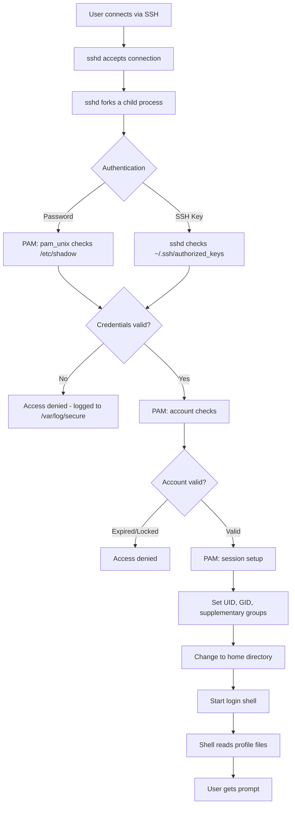
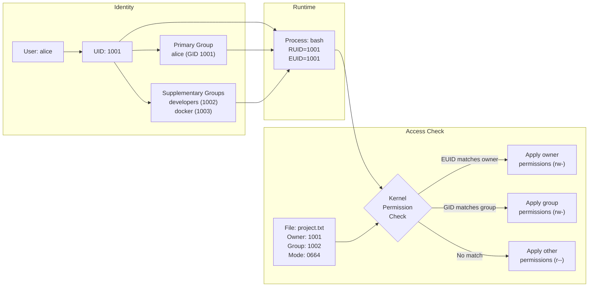

# Module 1: Linux User Management Fundamentals

## Introduction

Linux is a **multi-user operating system**. This means multiple people (or programs) can use the same Linux system at the same time, each with their own identity, their own files, and their own boundaries. Understanding how Linux manages users is the foundation of everything else in system administration — permissions, security, sudo, services, and troubleshooting all depend on it.

This module covers what a user account actually is, how Linux identifies users internally, the different types of user accounts, and what happens behind the scenes when someone logs in.

---

## What Is a User Account in Linux?

A **user account** is an identity on a Linux system. Every action on a Linux system — every process running, every file created, every command executed — is associated with a user account.

A user account consists of:

| Component | Description | Example |
|-----------|-------------|---------|
| Username | Human-readable name | `alice` |
| UID | Numeric user identifier | `1001` |
| Primary GID | Numeric primary group ID | `1001` |
| Home directory | Personal file storage | `/home/alice` |
| Login shell | Program started at login | `/bin/bash` |
| GECOS field | Comment (usually full name) | `Alice Smith` |
| Password | Authentication credential | Stored as hash in `/etc/shadow` |

User accounts exist because Linux needs to:

1. **Identify** who is performing an action
2. **Authenticate** that the person is who they claim to be
3. **Authorize** what that person is allowed to do
4. **Audit** what actions were performed and by whom
5. **Isolate** users from each other so they cannot interfere with each other's work

---

## User Identity: The UID (User ID)

Here is a critical fact that many beginners miss:

> **The Linux kernel does not know or care about usernames. It only understands numeric User IDs (UIDs).**

When you type `alice` as a username, user-space tools (like `login`, `ls`, `ps`) translate that name to a number by looking it up in `/etc/passwd` or another identity source via NSS (Name Service Switch). The kernel only sees the number.

### How UID Mapping Works

```
Username "alice"  →  /etc/passwd lookup  →  UID 1001
                                              ↓
                                    Kernel uses UID 1001
                                    for ALL permission checks
```

This means:

- If two accounts have the same UID, the kernel treats them as the **same user**, regardless of the username.
- If you delete a user but leave their files on disk, the files still have the old UID. If a new user is created with the same UID, that new user **inherits access** to the old files.
- File permissions, process ownership, and access checks all use UIDs, never usernames.

### UID Ranges on RHEL 9 / AlmaLinux 9

UIDs are not assigned randomly. Linux distributions define ranges for different types of accounts in `/etc/login.defs`:

| UID Range | Type | Purpose | Example |
|-----------|------|---------|---------|
| 0 | Root | Superuser | `root` |
| 1–999 | System/Service accounts | Daemons and services | `nginx` (993), `sshd` (74) |
| 1000–60000 | Regular users | Human users | `alice` (1001), `bob` (1002) |
| 65534 | Nobody | Unprivileged fallback | `nobody` |

These ranges come from `/etc/login.defs`:

```
UID_MIN         1000
UID_MAX        60000
SYS_UID_MIN      201
SYS_UID_MAX      999
```

**On Debian/Ubuntu**, the ranges are similar but `SYS_UID_MIN` starts at 100 instead of 201.

---

## UID 0: The Root Account

UID 0 is special. The Linux kernel grants **almost unlimited privileges** to any process running with UID 0.

- Root can read, write, or execute almost any file.
- Root can send signals to any process.
- Root can bind to privileged network ports (below 1024).
- Root can change file ownership.
- Root can load kernel modules.
- Root can change system clock, mount filesystems, and more.

**Important security notes:**

- There should be exactly **one account with UID 0** on the system. If you find multiple accounts with UID 0, treat it as a security incident.
- Never log in directly as root in production. Use `sudo` instead.
- The name "root" is a convention. The kernel only checks UID 0, not the name. An account named "admin" with UID 0 would have the same power.

---

## Types of Users

### Normal (Regular) Users

Regular users are accounts created for human beings who log in to the system.

| Feature | Details |
|---------|---------|
| UID range | 1000–60000 (configurable in `/etc/login.defs`) |
| Home directory | `/home/username` |
| Login shell | `/bin/bash` (or another valid shell) |
| Created with | `useradd` or `useradd -m` |
| Password | Usually set, allows login |
| Interactive login | Yes |
| Purpose | Day-to-day work by human users |

Example `/etc/passwd` entry:

```
alice:x:1001:1001:Alice Smith:/home/alice:/bin/bash
```

### System (Service) Users

System users are accounts created for applications, daemons, and services. They are not meant for human login.

| Feature | Details |
|---------|---------|
| UID range | 1–999 |
| Home directory | Application directory or `/dev/null` |
| Login shell | `/sbin/nologin` or `/bin/false` |
| Created with | `useradd -r` |
| Password | Typically locked (`*` or `!!` in `/etc/shadow`) |
| Interactive login | No (prevented by shell) |
| Purpose | Running services like nginx, Apache, MySQL |

Example `/etc/passwd` entry:

```
nginx:x:993:991:Nginx web server:/var/lib/nginx:/sbin/nologin
```

**Why use service accounts?**

- **Security**: If a service is compromised, the attacker gets the limited privileges of the service account, not root.
- **Isolation**: The service can only access files it owns or has permission for.
- **Accountability**: Logs show which service performed which action.

### Root User

| Feature | Details |
|---------|---------|
| UID | 0 |
| Home directory | `/root` |
| Login shell | `/bin/bash` |
| Password | Should be set but rarely used directly |
| Privileges | Unrestricted |
| Purpose | System administration (use via sudo) |

### Comparison Table

| Feature | Normal User | System User | Root |
|---------|------------|-------------|------|
| UID Range | 1000+ | 1–999 | 0 |
| Home Directory | `/home/username` | Varies or none | `/root` |
| Login Shell | `/bin/bash` | `/sbin/nologin` | `/bin/bash` |
| Interactive Login | Yes | No | Avoid |
| Password | Set by admin | Locked | Set but use sudo |
| Created With | `useradd` | `useradd -r` | Pre-exists |
| Purpose | Human users | Services/daemons | Administration |

---

## Login Shells and Non-Login Shells

Understanding shell types is important for troubleshooting environment issues and for security.

### Login Shell

A **login shell** is the first shell that runs when a user logs in (via console, SSH, or `su -`). It reads a specific set of startup files to set up the environment.

**Startup files read by a bash login shell (in order):**

1. `/etc/profile` (system-wide settings)
2. `/etc/profile.d/*.sh` (modular system-wide scripts)
3. `~/.bash_profile` (user-specific, checked first)
4. `~/.bash_login` (checked if `~/.bash_profile` doesn't exist)
5. `~/.profile` (checked if neither of the above exists)

### Non-Login Shell

A **non-login shell** is started when you open a new terminal window in a GUI, run `bash` from an existing shell, or execute a script. It reads fewer startup files.

**Startup files read by a bash non-login shell:**

1. `~/.bashrc` (user-specific)

**Note:** On most distributions, `~/.bash_profile` sources `~/.bashrc`, so both are effectively loaded during login.

### Interactive vs Non-Interactive Shells

| Type | Description | Example |
|------|-------------|---------|
| Interactive login | User logged in, has a prompt | SSH session, console login |
| Interactive non-login | Terminal opened, has a prompt | Opening a terminal in GNOME |
| Non-interactive | Running a script, no prompt | `bash script.sh`, cron jobs |

### Special Shells: `/sbin/nologin` and `/bin/false`

| Shell | Behavior | Use Case |
|-------|----------|----------|
| `/sbin/nologin` | Prints "This account is currently not available" and exits | Service accounts (polite denial) |
| `/bin/false` | Silently exits with error code 1 | Service accounts (silent denial) |
| `/bin/bash` | Normal interactive shell | Regular users |

**Important:** Setting a user's shell to `/sbin/nologin` prevents interactive login but does **not** prevent:
- SSH key-based command execution (e.g., `ssh user@host command`)
- File access if processes run as that user
- `su -s /bin/bash username` by root

---

## How the Kernel Identifies Users: Process Credentials

Every running process in Linux carries a set of **credentials** that determine what it can access. Understanding these is essential for advanced administration and security.

### Real UID (RUID)

The **Real UID** identifies **who actually started the process**. It is set when a user logs in and inherited by every process the user creates.

- Set at login time by the login program
- Inherited by child processes through `fork()`
- Does not change during normal operation
- Used to determine who to bill for resource usage

### Effective UID (EUID)

The **Effective UID** is what the kernel actually uses for **permission checks**. When a process tries to read a file, create a socket, or perform any privileged operation, the kernel checks the EUID.

- Usually equals the RUID
- Changes when executing a SUID program
- This is the UID that matters for access control

### Saved Set-User-ID (SSUID)

The **Saved Set-User-ID** stores the previous EUID when the EUID changes. This allows a process to temporarily drop privileges and regain them later.

- Set to the EUID at the time of `exec()`
- Allows a program to switch between privileged and unprivileged operation
- Used by programs like `passwd` to do privileged work then drop back

### Filesystem UID (FSUID)

The **Filesystem UID** is used specifically for filesystem access checks. It almost always equals the EUID and exists mainly for historical compatibility with NFS servers.

- Introduced for NFS server processes that needed to handle files on behalf of different users
- In normal operation, you can ignore this — it mirrors EUID
- Changed only with the `setfsuid()` system call

### Practical Example: What Happens When `alice` Runs `/usr/bin/passwd`

The `passwd` command needs to write to `/etc/shadow`, which is only writable by root. Here is what happens:

```
Step 1: alice (UID 1001) types "passwd" in her shell

   Process credentials of alice's shell:
   RUID = 1001, EUID = 1001

Step 2: Shell calls exec() on /usr/bin/passwd
   
   $ ls -l /usr/bin/passwd
   -rwsr-xr-x. 1 root root 32648 ... /usr/bin/passwd
   
   Notice the 's' in owner execute position = SUID bit is set.
   The file is owned by root (UID 0).

Step 3: Because SUID is set, the kernel changes the EUID:

   RUID = 1001  (still alice — she started the process)
   EUID = 0     (root — because of SUID on the executable)
   SSUID = 0    (saved for later)

Step 4: passwd can now write to /etc/shadow
   
   The kernel checks EUID (0 = root) for the write operation.
   Root can write to /etc/shadow. Access granted.

Step 5: passwd checks RUID to know WHICH user's password to change
   
   RUID = 1001 = alice
   passwd changes alice's password, not root's.

Step 6: passwd finishes and exits. The process is gone.
```

This example shows why both RUID and EUID matter — EUID provides the privilege, RUID provides the identity.

---

## Process Ownership and Permissions

Every process on Linux runs with the credentials of a specific user. These credentials determine what the process can do.

### How Processes Inherit Identity

```
User logs in as alice (UID 1001)
    └── bash (RUID=1001, EUID=1001)
        ├── vim file.txt (RUID=1001, EUID=1001)
        ├── ls /home (RUID=1001, EUID=1001)
        └── /usr/bin/passwd (RUID=1001, EUID=0)  ← SUID changes EUID
```

1. When a user logs in, the login program sets the UID of the shell process.
2. When the shell starts a new program (`fork()` + `exec()`), the child inherits the parent's credentials.
3. The EUID only changes if the executed file has the SUID bit set.

### Viewing Process Credentials

```bash
# Show UID and EUID for all processes
$ ps -eo pid,uid,euid,user,comm --sort=pid | head -20
  PID   UID  EUID USER     COMMAND
    1     0     0 root     systemd
    2     0     0 root     kthreadd
  645    81    81 dbus     dbus-daemon
  731     0     0 root     sshd
 1502  1001  1001 alice    bash
 1530  1001  1001 alice    vim
```

Notice how `dbus-daemon` runs as UID 81 (the `dbus` system user), and alice's bash and vim both run as UID 1001.

---

## What Happens When a User Logs In

Understanding the login process helps with troubleshooting. Here is the step-by-step flow for a typical SSH login:

### Login Flow



### Detailed Steps

| Step | What Happens | Component |
|------|-------------|-----------|
| 1 | User initiates SSH connection | SSH client |
| 2 | sshd accepts and forks child process | sshd |
| 3 | Authentication is attempted | PAM + sshd |
| 4 | Password checked against hash in `/etc/shadow` | `pam_unix` |
| 5 | Account validity checked (not expired, not locked) | `pam_unix` |
| 6 | Account restrictions checked (access.conf, etc.) | PAM stack |
| 7 | Session created (utmp/wtmp updated, limits applied) | PAM session |
| 8 | Process UID, GID, supplementary groups set | `setuid()`, `setgid()`, `initgroups()` |
| 9 | Working directory changed to home | `chdir()` |
| 10 | Login shell executed | `exec()` |
| 11 | Shell reads `/etc/profile`, `~/.bash_profile` | bash |
| 12 | User receives command prompt | bash |

### Console Login Flow

Console login follows a similar path but starts with `getty` instead of `sshd`:

1. `systemd` starts `getty` on a virtual terminal (e.g., `/dev/tty1`)
2. `getty` displays "login:" prompt
3. User enters username
4. `getty` calls `login` program
5. `login` prompts for password
6. PAM authenticates the user
7. Steps 6–12 are the same as SSH login

---

## Local Accounts vs Centralized Identity Management

### Local Accounts

By default, user accounts are stored in local files on each machine:

| File | Contains |
|------|----------|
| `/etc/passwd` | Username, UID, GID, home directory, shell |
| `/etc/shadow` | Password hashes, account aging information |
| `/etc/group` | Group names, GIDs, group membership |

**Advantages:**
- Simple — no external dependencies
- Works without network connectivity
- Fast lookups

**Disadvantages:**
- Must be managed separately on every server
- No centralized password changes
- Difficult to manage at scale (100+ servers)

### Centralized Identity Management

In production environments with many servers, organizations use centralized identity systems:

| System | Description |
|--------|-------------|
| **LDAP** | Lightweight Directory Access Protocol — directory service for storing user data (OpenLDAP, 389 DS) |
| **Active Directory** | Microsoft's directory service — Linux can join via SSSD and `realmd` |
| **FreeIPA** | Integrated identity management for Linux (combines LDAP + Kerberos + DNS + CA) |
| **SSSD** | System Security Services Daemon — caches identity data locally, connects to LDAP/AD/FreeIPA |

### How NSS Ties It Together

The **Name Service Switch** (`/etc/nsswitch.conf`) tells the system where to look for user information:

```
passwd:     files sss
shadow:     files sss
group:      files sss
```

This means:
1. First check local files (`/etc/passwd`, `/etc/shadow`, `/etc/group`)
2. Then check SSSD (`sss`) for LDAP/AD/FreeIPA users

If you run `getent passwd alice`:
- NSS first checks `/etc/passwd`
- If not found, NSS asks SSSD
- SSSD queries the configured identity source (LDAP, AD, etc.)
- Result is returned (and cached by SSSD)

---

## Authentication vs Authorization

These two concepts are frequently confused but are fundamentally different.

### Authentication: "Who Are You?"

**Authentication** is the process of verifying a user's identity — proving that you are who you claim to be.

| Method | How It Works |
|--------|-------------|
| Password | User provides a secret that matches the stored hash |
| SSH key | User proves possession of a private key matching a public key |
| Kerberos ticket | User obtains a ticket from a trusted authority |
| Certificate | User presents a cryptographic certificate |
| Multi-factor | Combination of two or more methods |

On Linux, authentication is primarily handled by **PAM** (Pluggable Authentication Modules) and SSH.

### Authorization: "What Can You Do?"

**Authorization** determines what an authenticated user is permitted to do.

| Mechanism | What It Controls |
|-----------|-----------------|
| File permissions | Read, write, execute access to files |
| sudo / sudoers | Which commands a user can run as root or another user |
| ACLs | Fine-grained file access for specific users/groups |
| SELinux / AppArmor | Mandatory access control policies |
| PAM (account) | Login restrictions (time, location, etc.) |

### Comparison

| Aspect | Authentication | Authorization |
|--------|---------------|---------------|
| Question answered | "Who are you?" | "What can you do?" |
| When it happens | At login time | At every access attempt |
| Failure message | "Login incorrect" | "Permission denied" |
| Managed by | PAM, sshd, Kerberos | Kernel, sudo, filesystem |
| Credentials used | Password, SSH key, token | UID, GID, process credentials |
| Can succeed alone? | Yes (you can authenticate but be denied access) | No (you must authenticate first) |

### Example

1. Alice enters her password and SSH verifies it. **Authentication succeeds.**
2. Alice tries to read `/var/log/secure`. The kernel checks her UID against the file's permissions. The file is owned by root with mode 0600. **Authorization fails** — "Permission denied."

Authentication and authorization are handled by different subsystems. A user can authenticate successfully but still be denied access to specific resources.

---

## Relationship Diagram: User → UID → Groups → Process → File Access



### How It Works End to End

1. **alice** logs in. The system looks up her UID (1001) and her groups.
2. A **process** (her shell) is created with RUID=1001, EUID=1001, GID=1001, supplementary GIDs=[1002, 1003].
3. When alice runs a command that accesses a file, the **kernel** checks:
   - Is the process EUID the file's owner UID? → Use owner permissions
   - Does the process GID or any supplementary GID match the file's group? → Use group permissions
   - Otherwise → Use "other" permissions
4. The first match wins. If alice is the owner, **only** owner permissions are checked — even if group or other permissions are more permissive.

---

## Interview Questions and Answers

### Q1: What is a UID in Linux and why does Linux use it instead of usernames?

**Answer:** A UID (User ID) is a numeric identifier assigned to each user account. The Linux kernel exclusively uses UIDs for all internal operations — permission checks, process ownership, file ownership. Usernames are a human-friendly abstraction that exists only in user-space tools and configuration files like `/etc/passwd`. The kernel never sees or uses usernames. This design is efficient because comparing numbers is faster than comparing strings, and it separates the naming convention from the security mechanism.

**Follow-up:** What happens if two users have the same UID?
**Answer:** The kernel treats them as the same user. Both have identical access to files, processes, and resources. This is a security misconfiguration that should never exist in production.

### Q2: What is the difference between a normal user and a system user?

**Answer:** Normal users (UID 1000+) are created for human beings who log in interactively. They have home directories under `/home/` and a login shell like `/bin/bash`. System users (UID 1-999) are created for services and daemons like nginx, mysql, or sshd. They have `/sbin/nologin` as their shell to prevent interactive login and are created with `useradd -r`. The distinction is primarily about UID ranges and defaults — the kernel treats them all the same based on UID.

### Q3: What happens when a user runs a SUID executable?

**Answer:** When a user executes a file with the SUID bit set, the process's Effective UID (EUID) changes to the UID of the file's **owner** instead of the UID of the user who ran it. The Real UID (RUID) remains unchanged. For example, when user alice (UID 1001) runs `/usr/bin/passwd` (owned by root, SUID set), the process runs with RUID=1001 and EUID=0. This allows the process to write to `/etc/shadow` (owned by root) while knowing that the actual user is alice.

### Q4: Explain the difference between RUID and EUID with an example.

**Answer:** The Real UID (RUID) identifies who actually started a process — it never changes during normal operation and is inherited from the parent process. The Effective UID (EUID) is what the kernel checks for permission decisions. Normally they are the same. They differ when a SUID executable runs. Example: alice (UID 1001) runs `/usr/bin/passwd`. The process has RUID=1001 (alice started it) and EUID=0 (root's UID, because passwd is SUID root). The EUID=0 lets passwd write to `/etc/shadow`, while RUID=1001 tells passwd which user's password to change.

### Q5: What is the difference between authentication and authorization?

**Answer:** Authentication is verifying identity — proving you are who you claim to be (via password, SSH key, etc.). Authorization is checking what an authenticated user is allowed to do (via file permissions, sudo rules, ACLs). They are handled by different subsystems: PAM handles authentication, the kernel and sudo handle authorization. A user can authenticate successfully but still be denied access to a resource if authorization fails.

### Q6: What happens step by step when a user logs into a Linux system via SSH?

**Answer:** (1) The SSH client connects to sshd on port 22. (2) sshd forks a child process. (3) Authentication occurs — the user provides a password or SSH key. (4) PAM verifies the credentials against `/etc/shadow` or the key against `~/.ssh/authorized_keys`. (5) PAM checks account validity — not expired, not locked. (6) PAM sets up the session — applies limits, updates login records. (7) The child process sets the UID, GID, and supplementary groups using system calls. (8) The working directory changes to the user's home directory. (9) The user's login shell is executed. (10) The shell reads startup files (`/etc/profile`, `~/.bash_profile`). (11) The user gets a command prompt.

### Q7: What UID does the root user have and why is it special?

**Answer:** Root has UID 0. It is special because the kernel explicitly checks for UID 0 in its access control code. Processes running as UID 0 bypass most permission checks — they can read/write any file, send signals to any process, bind to privileged ports, mount filesystems, and perform other operations that are denied to all other UIDs. The name "root" is just a convention in `/etc/passwd` — the actual power comes from UID 0.

### Q8: Why should you use `/sbin/nologin` for service accounts?

**Answer:** Service accounts run daemons and background processes — they should never be used for interactive login by humans. Setting the shell to `/sbin/nologin` prevents interactive login attempts. If someone tries to log in as the service user, they see "This account is currently not available" and the session ends. This limits the attack surface: even if an attacker discovers the service account's credentials, they cannot get an interactive shell. However, it does not prevent the account from running processes via systemd or being switched to by root with `su -s /bin/bash serviceuser`.

### Q9: What is the difference between a login shell and a non-login shell?

**Answer:** A login shell is the first shell started when a user logs in (via console, SSH, or `su -`). It reads `/etc/profile`, `/etc/profile.d/*.sh`, and `~/.bash_profile`. A non-login shell is started inside an existing session (opening a terminal in a GUI, running `bash`, or running a script). It only reads `~/.bashrc`. This matters for troubleshooting: if an environment variable is set in `~/.bash_profile` but not `~/.bashrc`, it will be available in an SSH session but not in a terminal window opened from the desktop.

### Q10: How does the kernel determine if a process can access a file?

**Answer:** The kernel uses the process's Effective UID (EUID), Effective GID (EGID), and supplementary group list to check against the file's owner UID, owner GID, and permission bits. The algorithm is: (1) If EUID is 0 (root), access is usually granted. (2) If EUID matches the file's owner UID, the owner permission bits are checked. (3) If EGID or any supplementary GID matches the file's group, the group permission bits are checked. (4) Otherwise, the "other" permission bits are checked. Critically, the first matching category is used exclusively — if you match as owner, only owner permissions apply, even if group or other permissions are more permissive.

### Q11: Why does changing a user's groups require a new login session?

**Answer:** When a user logs in, the login process calls `initgroups()` to load the user's group memberships into the process credentials. These credentials are copied to every child process via `fork()`. If an administrator adds the user to a new group with `usermod -aG`, the change is written to `/etc/group` but the user's existing processes still have the old group list cached in their process credentials. The user must log out and log back in (or use `newgrp groupname`) for the new group to appear in their process credentials.

---

## Hands-On Exercises

### Exercise 1: Examine Your Own Identity

```bash
# Check your username
whoami

# Check your UID, GID, and all groups
id

# Check just your UID
id -u

# Check your primary group name
id -gn

# Check all your supplementary group names
id -Gn
```

**Expected output (example):**

```
$ id
uid=1001(alice) gid=1001(alice) groups=1001(alice),10(wheel),1002(developers)
```

### Exercise 2: Compare User Entries in `/etc/passwd`

```bash
# Look at the root account
getent passwd root

# Look at a regular user
getent passwd alice

# Look at a system account
getent passwd nginx

# Look at the nobody account
getent passwd nobody
```

Compare the home directories and shells. Notice how system accounts use `/sbin/nologin`.

### Exercise 3: Examine System Account Shells

```bash
# Find all accounts that use /sbin/nologin
grep '/sbin/nologin' /etc/passwd | head -10

# Count how many service accounts exist
grep -c '/sbin/nologin' /etc/passwd

# Find all accounts with a real login shell
grep -v '/sbin/nologin\|/bin/false' /etc/passwd
```

### Exercise 4: View Process Credentials

```bash
# Show PID, real UID, effective UID, and command for running processes
ps -eo pid,ruid,euid,comm | head -20

# Find processes where RUID differs from EUID (SUID in action)
ps -eo pid,ruid,euid,comm | awk '$2 != $3'
```

### Exercise 5: Check UID Ranges in `/etc/login.defs`

```bash
# View the UID range configuration
grep -E '^(UID|GID|SYS_UID|SYS_GID)' /etc/login.defs
```

**Expected output on RHEL 9:**

```
UID_MIN                  1000
UID_MAX                 60000
SYS_UID_MIN               201
SYS_UID_MAX               999
GID_MIN                  1000
GID_MAX                 60000
SYS_GID_MIN               201
SYS_GID_MAX               999
```

### Exercise 6: Understand UID-Based File Ownership

```bash
# Create a file and check its ownership
touch /tmp/test_ownership
ls -ln /tmp/test_ownership

# The -n flag shows numeric UID/GID instead of names
# Compare with:
ls -l /tmp/test_ownership
```

Notice that `ls -l` shows the username, but `ls -ln` shows the numeric UID. The filesystem stores the UID, not the username.

---

## Summary

| Concept | Key Point |
|---------|-----------|
| User account | An identity on the system with UID, home, shell, and password |
| UID | Numeric ID — the kernel uses only this, never usernames |
| Root (UID 0) | Superuser — bypasses most permission checks |
| Normal users | UID 1000+, for humans, have home and shell |
| System users | UID 1-999, for services, no interactive login |
| RUID | Who started the process |
| EUID | What the kernel checks for permissions |
| Login shell | First shell at login — reads profile files |
| Non-login shell | Opened from existing session — reads ~/.bashrc |
| Authentication | Proving who you are |
| Authorization | Checking what you can do |
| NSS | Determines where user information comes from |
| PAM | Framework for authentication methods |

---

**Next Module:** [Module 2: User Management Commands](02-user-management-commands.md) — Learn the commands to create, modify, and delete user accounts.
