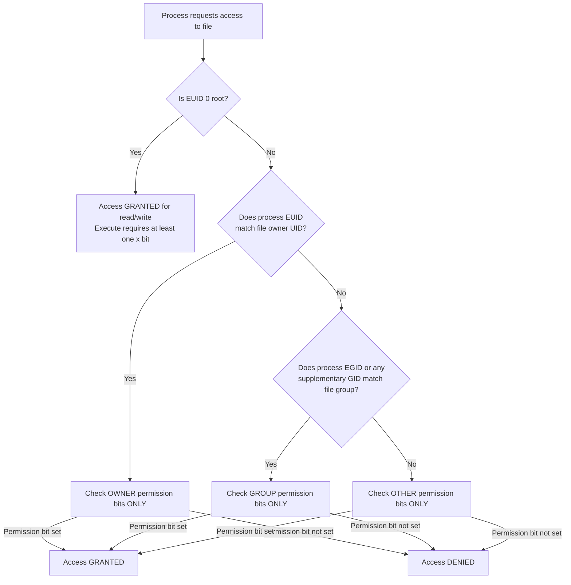

# Module 5: Linux File Permissions Fundamentals

## Introduction

Linux file permissions are the core mechanism that controls who can read, write, or execute files and directories. Every file and directory on a Linux system has an owner, a group, and a set of permission bits that determine access. Understanding how permissions work — especially for directories — is essential for system administration and security.

---

## File Ownership

Every file and directory in Linux has two ownership attributes:

| Attribute | Description | Example |
|-----------|-------------|---------|
| **Owner (user)** | The user who owns the file | `alice` (UID 1001) |
| **Group** | The group associated with the file | `developers` (GID 1002) |

These are stored as numeric UID and GID in the filesystem inode. Commands like `ls -l` translate them to names using `/etc/passwd` and `/etc/group`.

```bash
$ ls -l report.txt
-rw-r--r--. 1 alice developers 4096 Sep 22 10:00 report.txt
              ^^^^^  ^^^^^^^^^^
              owner  group
```

Ownership and permissions are independent — you can change one without affecting the other.

---

## The Three Permission Classes

Linux divides all users into three classes for each file:

| Class | Symbol | Who It Applies To |
|-------|--------|-------------------|
| **User (Owner)** | `u` | The user who owns the file |
| **Group** | `g` | Members of the file's group |
| **Other** | `o` | Everyone else on the system |

There is also a shorthand:
- **All** (`a`) = user + group + other

---

## The Three Permission Types

Each class can have three types of permissions:

| Permission | Symbol | Numeric | On Files | On Directories |
|-----------|--------|---------|----------|----------------|
| **Read** | `r` | 4 | View file contents | List directory contents (`ls`) |
| **Write** | `w` | 2 | Modify file contents | Create, delete, rename entries |
| **Execute** | `x` | 1 | Run as a program | Enter the directory (`cd`), traverse |

---

## Reading Permission Strings

The `ls -l` command displays permissions as a 10-character string:

```
-rwxr-xr--
```

| Position | Character | Meaning |
|----------|-----------|---------|
| 1 | `-` | File type |
| 2-4 | `rwx` | Owner permissions (read, write, execute) |
| 5-7 | `r-x` | Group permissions (read, no write, execute) |
| 8-10 | `r--` | Other permissions (read, no write, no execute) |

### File Type Characters

| Character | Type |
|-----------|------|
| `-` | Regular file |
| `d` | Directory |
| `l` | Symbolic link |
| `c` | Character device |
| `b` | Block device |
| `p` | Named pipe (FIFO) |
| `s` | Socket |

### Examples

```
-rw-r--r--   Regular file: owner reads/writes, group reads, others read
drwxr-xr-x   Directory: owner full, group can list/enter, others can list/enter
-rwx------   Executable: only owner can read/write/execute
lrwxrwxrwx   Symbolic link: permissions shown are for the link itself (not the target)
drwxrwxrwt   Directory with sticky bit: the 't' in the last position
-rwsr-xr-x   Executable with SUID: the 's' in owner execute position
```

---

## Numeric (Octal) Permissions

Each permission type has a numeric value:

| Permission | Value |
|-----------|-------|
| Read (r) | 4 |
| Write (w) | 2 |
| Execute (x) | 1 |
| None (-) | 0 |

The total for each class is the sum of its permissions:

| Combination | Calculation | Total |
|------------|-------------|-------|
| `rwx` | 4+2+1 | **7** |
| `rw-` | 4+2+0 | **6** |
| `r-x` | 4+0+1 | **5** |
| `r--` | 4+0+0 | **4** |
| `-wx` | 0+2+1 | **3** |
| `-w-` | 0+2+0 | **2** |
| `--x` | 0+0+1 | **1** |
| `---` | 0+0+0 | **0** |

A complete permission set is three digits (owner, group, other):

| Numeric | Symbolic | Meaning |
|---------|----------|---------|
| `755` | `rwxr-xr-x` | Owner full, group/other read+execute |
| `644` | `rw-r--r--` | Owner read+write, group/other read only |
| `700` | `rwx------` | Owner full, no access for others |
| `600` | `rw-------` | Owner read+write, no access for others |
| `750` | `rwxr-x---` | Owner full, group read+execute, other none |
| `640` | `rw-r-----` | Owner read+write, group read, other none |
| `777` | `rwxrwxrwx` | Full access for everyone (AVOID) |
| `000` | `----------` | No access for anyone (root can still access) |

### Common Production Permissions

| Permission | Typical Use |
|-----------|-------------|
| `755` | Executable files, public directories |
| `644` | Regular files (configs, documents) |
| `700` | Private directories (home directories on RHEL 9) |
| `600` | Sensitive files (private keys, credentials) |
| `750` | Group-shared application directories |
| `640` | Group-readable config files |
| `400` | Read-only sensitive files (SSL certificates) |

---

## How Linux Evaluates File Access

This is one of the most important concepts in Linux permissions. The kernel follows a specific algorithm when a process tries to access a file:

### Step-by-Step Permission Evaluation



### Critical Rule: First Match Wins

**Once a category matches, ONLY that category's permissions are checked.** This leads to a counterintuitive situation:

```bash
# File owned by alice, group developers, mode 074
$ ls -l secret.txt
----rwxr--. 1 alice developers 100 Sep 22 10:00 secret.txt
```

- **alice** (the owner) tries to read → DENIED (owner permissions are `---`)
- **bob** (member of developers) tries to read → GRANTED (group permissions are `rwx`)
- **charlie** (not owner, not in group) tries to read → GRANTED (other permissions are `r--`)

**The owner has LESS access than everyone else!** This is because the kernel matches alice as the owner first and checks only the owner bits (`---`), which deny access. It never falls through to group or other.

This is an important interview question and a real troubleshooting scenario.

---

## Directory Permissions vs File Permissions

Permissions mean different things for files and directories. This is a major source of confusion.

### Comparison Table

| Permission | On a Regular File | On a Directory |
|-----------|-------------------|----------------|
| **Read (r)** | View the file's contents | List the directory's contents (`ls`) |
| **Write (w)** | Modify the file's contents | Create, delete, or rename entries in the directory |
| **Execute (x)** | Run the file as a program | Enter the directory (`cd`), access files within it |

### Key Directory Permission Rules

#### 1. Execute (x) on a directory = Traverse permission

Without execute permission on a directory, you cannot:
- `cd` into it
- Access ANY file inside it, even if you have full permissions on the file
- Use the directory in a file path

```bash
# Directory with read but NO execute
$ ls -ld /opt/project/
drw-r--r--. 2 root root 4096 Sep 22 10:00 /opt/project/

$ ls /opt/project/        # Shows filenames (read works)
file1.txt  file2.txt

$ cat /opt/project/file1.txt   # FAILS! Cannot traverse directory
cat: /opt/project/file1.txt: Permission denied

$ cd /opt/project/             # FAILS! Cannot enter
bash: cd: /opt/project/: Permission denied
```

#### 2. Write (w) on a directory = Create/Delete entries

The write permission on a **directory** controls whether you can create, delete, or rename files in it. Importantly:

> **You do NOT need write permission on a file to delete it. You need write permission on the DIRECTORY containing the file.**

```bash
# alice owns the directory with write permission
$ ls -ld /shared/
drwxrwx---. 2 alice team 4096 Sep 22 10:00 /shared/

# bob (member of team) can delete alice's files!
$ ls -l /shared/alice-file.txt
-rw-r--r--. 1 alice alice 100 Sep 22 10:00 /shared/alice-file.txt

# bob deletes it (he has write on the DIRECTORY)
$ rm /shared/alice-file.txt
# SUCCESS — directory write permission allows deletion
```

This is why the **sticky bit** exists on `/tmp` — to prevent users from deleting other users' files even though everyone has write access to the directory.

#### 3. Read (r) on a directory = List contents

Without read permission, you cannot list what is inside the directory. But if you know a filename and have execute permission, you can still access the file:

```bash
# Directory with execute but NO read
$ ls -ld /opt/secret/
d--x--x--x. 2 root root 4096 Sep 22 10:00 /opt/secret/

$ ls /opt/secret/              # FAILS — cannot list
ls: cannot open directory '/opt/secret/': Permission denied

$ cat /opt/secret/known-file.txt   # WORKS if you know the filename
# (because you have execute/traverse permission)
```

---

## How Parent Directory Permissions Affect Access

To access a file, you need **execute permission on every directory in the path** from the root to the file.

```bash
# Path: /home/alice/projects/webapp/config.yml
# You need execute permission on:
#   /
#   /home
#   /home/alice
#   /home/alice/projects
#   /home/alice/projects/webapp
# AND read permission on config.yml itself
```

If ANY directory in the path lacks execute permission for the user, access is denied — even if the file itself has `777` permissions.

### Diagnosing Path Permission Issues

Use `namei -l` to check permissions along an entire path:

```bash
$ namei -l /home/alice/projects/webapp/config.yml
f: /home/alice/projects/webapp/config.yml
dr-xr-xr-x root  root  /
drwxr-xr-x root  root  home
drwx------ alice alice  alice        # ← Only alice can traverse!
drwxr-xr-x alice alice  projects
drwxr-xr-x alice alice  webapp
-rw-r--r-- alice alice  config.yml
```

In this example, only alice (and root) can access anything under `/home/alice/` because the home directory has `700` permissions. Even if `config.yml` is `644`, other users cannot reach it.

---

## Practical Examples

### Example 1: User Can Read but Cannot Modify

```bash
$ ls -l report.txt
-rw-r--r--. 1 alice developers 4096 Sep 22 10:00 report.txt

# bob is in the "developers" group
$ id bob
uid=1002(bob) gid=1002(bob) groups=1002(bob),1003(developers)

# bob can read (group has r--)
$ cat report.txt
(contents displayed)

# bob cannot write (group does NOT have w)
$ echo "edit" >> report.txt
bash: report.txt: Permission denied
```

### Example 2: User Can Access File Only Through Group

```bash
$ ls -l shared-data.txt
-rw-rw----. 1 root projteam 4096 Sep 22 10:00 shared-data.txt

# charlie is in the projteam group
$ id charlie
uid=1003(charlie) gid=1003(charlie) groups=1003(charlie),1005(projteam)

# charlie is NOT the owner (root is), but group permissions apply
# charlie can read AND write (group has rw-)
$ cat shared-data.txt
(contents displayed)
$ echo "new data" >> shared-data.txt
# Success
```

### Example 3: Cannot Access File Despite Having Permissions

```bash
$ ls -ld /root/
dr-x------. 3 root root 4096 Sep 22 10:00 /root/

$ ls -l /root/public-file.txt
-rw-r--r--. 1 root root 100 Sep 22 10:00 /root/public-file.txt

# alice tries to read the file
$ cat /root/public-file.txt
cat: /root/public-file.txt: Permission denied

# Even though the FILE is readable by everyone (644),
# the DIRECTORY /root/ is 700 (only root can traverse)
# alice cannot reach the file through the path
```

### Example 4: User Can Delete a File They Don't Own

```bash
$ ls -ld /shared/
drwxrwxr-x. 2 root team 4096 Sep 22 10:00 /shared/

$ ls -l /shared/alice-file.txt
-rw-r--r--. 1 alice alice 100 Sep 22 10:00 /shared/alice-file.txt

# bob (member of team) can delete alice's file
# because bob has write permission on the DIRECTORY
$ rm /shared/alice-file.txt
# Success! File deleted even though bob doesn't own it
```

### Example 5: Owner Denied Despite Others Having Access

```bash
$ ls -l odd-perms.txt
----rw-rw-. 1 alice developers 100 Sep 22 10:00 odd-perms.txt

# alice (the owner) tries to read
$ cat odd-perms.txt
cat: odd-perms.txt: Permission denied
# DENIED — owner permissions are "---"

# bob (in developers group) tries to read
$ cat odd-perms.txt
(contents displayed)
# GRANTED — group permissions are "rw-"
```

---

## Permission Evaluation Summary

| Scenario | Result | Reason |
|----------|--------|--------|
| Root (UID 0) reads any file | Allowed | Root bypasses most checks |
| Owner with `---` on file, other has `r--` | Denied | Owner class matches first, owner has no permissions |
| User in file's group, directory has `--x` | Can access file | Execute on directory allows traversal |
| User has `rwx` on file, but `---` on parent dir | Denied | Cannot traverse parent directory |
| User has `w` on directory, not on file | Can delete file | Directory write controls deletion |
| User has `w` on file, not on directory | Cannot delete file | Directory write is required for deletion |

---

## Interview Questions

### Q1: What are the three permission classes in Linux?

**Answer:** User (owner), Group, and Other. The user class applies to the file's owner, the group class applies to members of the file's group, and the other class applies to everyone else. When the kernel checks access, it determines which class the requesting process falls into and checks only that class's permissions.

### Q2: What does the execute permission mean on a directory?

**Answer:** Execute permission on a directory means **traverse** — the ability to enter the directory with `cd` and to access files within it by path. Without execute permission on a directory, you cannot access any file inside it, even if the file itself has full permissions. Read permission on a directory only allows listing contents, not accessing them.

### Q3: Can a user delete a file they don't own?

**Answer:** Yes. File deletion is controlled by **write permission on the directory**, not on the file. If a user has write permission on the directory containing a file, they can delete any file in that directory regardless of file ownership. The sticky bit on directories prevents this by restricting deletion to the file's owner, the directory's owner, and root.

### Q4: What is the difference between `chmod 755` and `chmod 750`?

**Answer:** `755` (rwxr-xr-x) allows the owner full access, and gives read+execute to both group and others. `750` (rwxr-x---) allows the owner full access, gives read+execute to the group, but gives **no access at all** to others. Use `750` when you want to restrict access to only the owner and a specific group, and `755` when the resource should be publicly accessible.

### Q5: How does Linux decide which permission class to check?

**Answer:** The kernel checks in this order: (1) If EUID is 0 (root), access is generally granted. (2) If EUID matches the file's owner UID, only owner permissions are checked. (3) If EGID or any supplementary GID matches the file's group, only group permissions are checked. (4) Otherwise, other permissions are checked. The first matching class is used exclusively — the kernel never falls through to a more permissive class.

### Q6: Why can a user who owns a file with `---` permissions not read it, even though "other" has `r--`?

**Answer:** Because the kernel uses the **first matching class**. The owner matches the "user" class, so only the user permission bits are checked. The user bits are `---`, so access is denied. The kernel does not fall through to check group or other permissions. To fix this, the owner can change the permissions with `chmod u+r file` — the owner can always change permissions on files they own.

### Q7: Why does a user need execute permission on all directories in a file path?

**Answer:** To reach a file, the kernel must resolve each component of the path. At each directory in the path, the kernel checks if the process has execute (traverse) permission. If any directory lacks execute permission for the user, the path resolution stops and access is denied, regardless of the permissions on the target file itself. This is why `namei -l` is useful for diagnosing "Permission denied" errors.

---

## Hands-On Exercises

### Exercise 1: Permission String to Numeric Conversion

Convert these permission strings to numeric:
1. `rwxr-xr-x` → ?
2. `rw-r--r--` → ?
3. `rwx------` → ?
4. `rw-rw----` → ?
5. `r-x--x--x` → ?

**Answers:** 755, 644, 700, 660, 511

### Exercise 2: Numeric to Permission String Conversion

Convert these numeric permissions to symbolic:
1. `750` → ?
2. `640` → ?
3. `711` → ?
4. `444` → ?
5. `600` → ?

**Answers:** rwxr-x---, rw-r-----, rwx--x--x, r--r--r--, rw-------

### Exercise 3: Predict Access Outcomes

File: `-rw-r-----. 1 alice developers 100 Sep 22 10:00 data.txt`

1. Can alice read the file? → **Yes** (owner has `rw-`)
2. Can bob (in developers group) write to the file? → **No** (group has `r--`, no write)
3. Can charlie (not owner, not in developers) read the file? → **No** (other has `---`)
4. Can root read the file? → **Yes** (root bypasses most checks)

### Exercise 4: Directory Permission Impact

```bash
$ ls -ld /test/
drwxr-x---. 2 root staff 4096 Sep 22 10:00 /test/

$ ls -l /test/public.txt
-rw-r--r--. 1 root root 100 Sep 22 10:00 /test/public.txt
```

1. Can alice (in staff group) read public.txt? → **Yes** (has execute on directory, file is 644)
2. Can bob (NOT in staff group) read public.txt? → **No** (other has `---` on directory, cannot traverse)
3. Can alice create a file in /test/? → **No** (group has `r-x` on directory, no write)

---

**Next Module:** [Module 6: Permission Commands and umask](06-permissions-commands-and-umask.md) — Learn the commands to change permissions and understand default permission creation.
