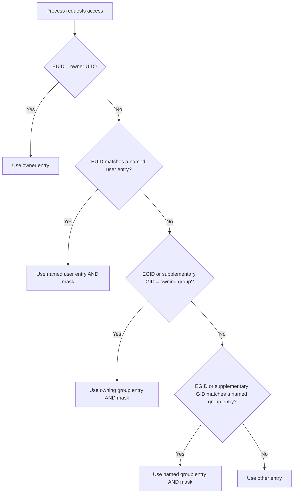

# Module 8: Linux ACLs (Access Control Lists)

## Introduction

Traditional Linux permissions (user, group, other) can define access for exactly one user, one group, and everyone else. But what if you need to give access to a second user or a second group without changing the file's ownership? ACLs solve this problem by allowing fine-grained access rules for any number of users and groups.

---

## Why Traditional Permissions Are Not Always Enough

Consider this scenario:

- A file is owned by `alice` in the `developers` group
- You need `bob` (who is NOT in `developers`) to have read access
- You do NOT want to give read access to everyone (other)

With traditional permissions, your options are:
1. Add bob to the `developers` group (may give him access to things he shouldn't have)
2. Change "other" to `r--` (gives access to ALL users)
3. Change the file's group (may break access for current group members)

None of these is ideal. ACLs solve this cleanly:

```bash
setfacl -m u:bob:r-- file.txt
```

Now bob can read the file without any other access changes.

---

## POSIX ACL Fundamentals

### ACL Entry Types

| Entry | Syntax | Description |
|-------|--------|-------------|
| Owner | `user::rwx` | Permissions for the file owner (same as chmod user) |
| Named user | `user:bob:r-x` | Permissions for a specific user |
| Owning group | `group::r-x` | Permissions for the owning group (same as chmod group) |
| Named group | `group:team:rw-` | Permissions for a specific group |
| Other | `other::r--` | Permissions for everyone else (same as chmod other) |
| Mask | `mask::r-x` | Upper bound on permissions for named users, named groups, and owning group |

### Access ACLs vs Default ACLs

| Type | Applies To | Purpose |
|------|-----------|---------|
| **Access ACL** | A specific file or directory | Controls who can access THIS file/directory |
| **Default ACL** | A directory only | Automatically applied to new files/subdirs created inside |

Default ACLs only exist on directories. When a new file is created inside a directory with default ACLs, the new file gets the default ACLs as its access ACLs.

---

## Commands

### getfacl — View ACLs

```bash
$ getfacl report.txt
# file: report.txt
# owner: alice
# group: developers
user::rw-
user:bob:r--
group::r--
group:designers:rw-
mask::rw-
other::---
```

**Reading the output:**
- `user::rw-` — owner (alice) has read+write
- `user:bob:r--` — named user bob has read only
- `group::r--` — owning group (developers) has read only
- `group:designers:rw-` — named group designers has read+write
- `mask::rw-` — the mask limits named users/groups to at most rw-
- `other::---` — everyone else has no access

### setfacl — Set ACLs

#### Add or Modify an ACL Entry

```bash
# Grant a specific user read access
setfacl -m u:bob:r-- file.txt

# Grant a specific user read+write access
setfacl -m u:charlie:rw- file.txt

# Grant a specific group read+execute access
setfacl -m g:designers:r-x file.txt

# Set multiple entries at once
setfacl -m u:bob:r--,g:designers:rw- file.txt
```

#### Remove an ACL Entry

```bash
# Remove a specific user ACL
setfacl -x u:bob file.txt

# Remove a specific group ACL
setfacl -x g:designers file.txt
```

#### Remove All ACLs

```bash
# Remove all ACLs (revert to traditional permissions)
setfacl -b file.txt
```

#### Set Default ACLs on a Directory

```bash
# Set default ACL for new files in this directory
setfacl -d -m u:bob:rwx /shared/project/

# Set default for a group
setfacl -d -m g:designers:rw- /shared/project/

# View default ACLs
getfacl /shared/project/
# Shows both access ACLs and default ACLs
```

#### Recursive ACL Operations

```bash
# Apply ACLs recursively
setfacl -R -m u:bob:r-x /opt/project/

# Set default ACLs recursively (for all existing subdirectories)
setfacl -R -d -m u:bob:r-x /opt/project/
```

#### Replace the Entire ACL

```bash
setfacl --set u::rwx,g::r-x,o::r--,u:bob:r-- file.txt
```

### ACL Backup and Restore

```bash
# Backup ACLs for an entire directory tree
getfacl -R /opt/project > /backup/project-acls.txt

# Restore ACLs from backup
setfacl --restore=/backup/project-acls.txt
```

---

## The ACL Mask

### What Is the Mask?

The mask entry acts as an **upper bound** (ceiling) on the effective permissions for:
- Named users
- Named groups
- The owning group

The mask does NOT affect the owner or "other" entries.

### How the Mask Works

The **effective permission** for a named user, named group, or owning group entry is the **intersection** (bitwise AND) of the entry's permission and the mask:

```
Effective = Entry AND Mask
```

Example:

```bash
$ getfacl file.txt
user::rw-
user:bob:rwx           # bob's ACL says rwx
group::r-x
mask::r--              # mask limits to r--
other::---

# bob's EFFECTIVE permission = rwx AND r-- = r--
# bob can only read, even though his ACL entry says rwx
```

### How chmod Affects the Mask

When you run `chmod` on a file that has ACLs, the **group permission** in chmod modifies the **mask**, not the owning group entry:

```bash
$ setfacl -m u:bob:rwx file.txt
$ getfacl file.txt
user::rw-
user:bob:rwx
group::r-x
mask::rwx
other::r--

$ chmod 644 file.txt    # Sets group to r--
$ getfacl file.txt
user::rw-
user:bob:rwx                 #effective:r--    ← mask limits this!
group::r-x                   #effective:r--
mask::r--                    ← chmod changed the mask to r--!
other::r--
```

This is a common source of confusion — `chmod` appears to break ACLs because it changes the mask.

### Fixing the Mask

```bash
# Explicitly set the mask
setfacl -m m::rwx file.txt
```

---

## The + Symbol in ls -l

When a file has ACLs, `ls -l` shows a `+` after the permission string:

```bash
$ ls -l file.txt
-rw-r--r--+ 1 alice developers 100 Sep 22 10:00 file.txt
          ^ ← ACLs are present

$ ls -l normal.txt
-rw-r--r--. 1 alice developers 100 Sep 22 10:00 normal.txt
          ^ ← no ACLs (dot means SELinux context only)
```

When you see `+`, use `getfacl` to view the actual ACL entries.

---

## ACLs and umask

When a file is created in a directory with default ACLs, the resulting permissions are determined by the default ACLs, **not the umask**. The default ACL entries for named users and named groups are applied directly. However, the mask of the new file's ACL is set to the intersection of the default ACL mask and the permissions requested by the creating process.

In practice, this means default ACLs largely override the umask for files created in that directory.

---

## Practical Examples

### Example 1: Grant One User Read Access

```bash
# File owned by alice, group developers
$ ls -l report.txt
-rw-r-----. 1 alice developers 4096 Sep 22 10:00 report.txt

# bob (not in developers) needs read access
$ setfacl -m u:bob:r-- report.txt

# Verify
$ getfacl report.txt
# file: report.txt
# owner: alice
# group: developers
user::rw-
user:bob:r--
group::r--
mask::r--
other::---

# bob can now read the file
$ su - bob -c "cat report.txt"
(contents displayed)

# Check ls -l shows the + indicator
$ ls -l report.txt
-rw-r-----+ 1 alice developers 4096 Sep 22 10:00 report.txt
```

### Example 2: Shared Project Directory with Default ACLs

```bash
# Create shared directory
sudo mkdir /opt/project
sudo chown root:projteam /opt/project
sudo chmod 2770 /opt/project  # SGID + rwxrwx---

# Add default ACLs so new files are accessible
# Default: projteam group gets rwx
sudo setfacl -d -m g:projteam:rwx /opt/project

# Default: QA team gets read-only
sudo setfacl -d -m g:qateam:r-x /opt/project

# Default: deployment user gets read access
sudo setfacl -d -m u:deploy:r-x /opt/project

# Verify
$ getfacl /opt/project
# file: opt/project
# owner: root
# group: projteam
# flags: -s-
user::rwx
group::rwx
other::---
default:user::rwx
default:user:deploy:r-x
default:group::rwx
default:group:qateam:r-x
default:mask::rwx
default:other::---

# Now when alice (in projteam) creates a file:
$ touch /opt/project/newfile.txt
$ getfacl /opt/project/newfile.txt
user::rw-
user:deploy:r-x               #effective:r--
group::rwx                     #effective:rw-
group:qateam:r-x               #effective:r--
mask::rw-
other::---
```

### Example 3: Troubleshoot ACL Not Working (Mask Issue)

```bash
# You set bob to have rwx
setfacl -m u:bob:rwx file.txt

# But bob can only read!
$ su - bob -c "echo test >> file.txt"
Permission denied

# Check the ACL
$ getfacl file.txt
user::rw-
user:bob:rwx         #effective:r--    ← The mask is limiting!
group::r--
mask::r--            ← The mask is r-- only
other::---

# Fix: set the mask to allow rwx
$ setfacl -m m::rwx file.txt

# Verify
$ getfacl file.txt
user::rw-
user:bob:rwx
group::r--
mask::rwx            ← Fixed
other::---
```

### Example 4: Remove a User's ACL Access

```bash
# Remove bob's specific ACL entry
setfacl -x u:bob file.txt

# Verify
$ getfacl file.txt
# bob's entry is gone, he now falls under "other" permissions
```

---

## ACL Evaluation Order

When the kernel checks access for a process against a file with ACLs:



Key points:
- Named user and group entries are always ANDed with the mask
- Owner and other entries are NOT affected by the mask
- First match wins (same as traditional permissions)

---

## Filesystem Support

ACLs require filesystem support. Most modern Linux filesystems support ACLs:

| Filesystem | ACL Support |
|-----------|-------------|
| ext4 | Yes (enabled by default) |
| XFS | Yes (enabled by default) |
| Btrfs | Yes |
| tmpfs | Yes |
| NFS | Depends on server configuration |
| FAT/VFAT | No |

On older systems, you may need to mount with the `acl` option:

```bash
mount -o acl /dev/sda1 /mnt
```

On RHEL 9 with ext4 and XFS, ACLs are enabled by default.

---

## Interview Questions

### Q1: What are ACLs and why do we need them?

**Answer:** ACLs (Access Control Lists) extend traditional Linux permissions by allowing you to define access for specific named users and named groups beyond the single owner and single group of traditional UGO permissions. You need ACLs when you must grant or deny access to specific users or groups without changing file ownership or creating new groups. For example, giving one contractor read access to a file without giving access to all "other" users.

### Q2: What is the ACL mask and how does it affect permissions?

**Answer:** The ACL mask is an upper bound on the effective permissions for named users, named groups, and the owning group. The effective permission is the intersection (bitwise AND) of the ACL entry and the mask. For example, if a named user has `rwx` but the mask is `r--`, the effective permission is `r--`. The mask does not affect the owner or "other" entries. Importantly, running `chmod` on a file with ACLs modifies the mask (not the owning group entry), which can unexpectedly restrict ACL permissions.

### Q3: What is the difference between an access ACL and a default ACL?

**Answer:** An access ACL defines permissions on a specific file or directory — it controls who can access that object. A default ACL can only be set on a directory and defines the ACL that will be automatically applied to new files and subdirectories created inside that directory. Default ACLs provide inheritance — new files get the default ACLs as their access ACLs. Default ACLs do not control access to the directory itself.

### Q4: How do you know if a file has ACLs from ls -l output?

**Answer:** A `+` sign appears after the permission string. For example, `-rw-r--r--+` indicates ACLs are present. Use `getfacl` to view the actual ACL entries. A `.` (dot) indicates an SELinux security context but no ACLs.

### Q5: How do default ACLs interact with umask?

**Answer:** When a file is created in a directory with default ACLs, the default ACLs largely override the umask. The named user and named group entries from the default ACL are applied to the new file. The mask of the new file is determined by the intersection of the default ACL mask and the permissions requested by the creating process. In practice, if you set up default ACLs on a directory, the umask has minimal impact on the resulting permissions.

---

**Next Module:** [Module 9: sudo and sudoers Fundamentals](09-sudo-and-sudoers-fundamentals.md) — Learn how Linux manages privilege escalation.
