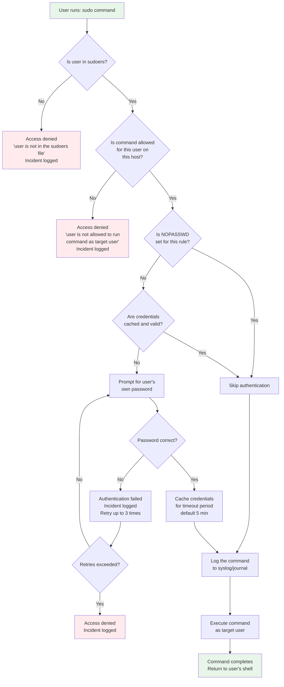

# 09 - sudo and sudoers Fundamentals

## Table of Contents

- [Introduction](#introduction)
- [Why sudo Exists](#why-sudo-exists)
- [How sudo Works Internally](#how-sudo-works-internally)
- [Authentication vs Authorization in sudo](#authentication-vs-authorization-in-sudo)
- [sudo Commands in Detail](#sudo-commands-in-detail)
- [Difference Between sudo -i and sudo -s](#difference-between-sudo--i-and-sudo--s)
- [su vs sudo vs Direct Root Login](#su-vs-sudo-vs-direct-root-login)
- [Important Files](#important-files)
- [visudo - The Safe Way to Edit sudoers](#visudo---the-safe-way-to-edit-sudoers)
- [The sudoers.d Directory](#the-sudoersd-directory)
- [Basic sudoers Syntax](#basic-sudoers-syntax)
- [sudo Command Execution Flow Diagram](#sudo-command-execution-flow-diagram)
- [Practical Examples](#practical-examples)
- [Troubleshooting sudo Issues](#troubleshooting-sudo-issues)
- [Interview Questions](#interview-questions)

---

## Introduction

The `sudo` command (short for "superuser do" or "substitute user do") is one of the most critical tools in Linux system administration. It allows authorized users to execute commands as another user (typically root) while maintaining accountability, granularity, and security. Every Linux administrator must understand sudo deeply -- it is a cornerstone of modern Linux security practices.

This guide covers sudo fundamentals using **AlmaLinux 9 / RHEL 9** as the primary reference, with notes on differences for Ubuntu/Debian systems where applicable.

---

## Why sudo Exists

### The Problem: Life Without sudo

In early Unix systems, there were only two ways to perform administrative tasks:

1. **Log in directly as root** -- either at the console or via SSH
2. **Use `su` to switch to root** -- which requires knowing the root password

Both approaches have serious problems:

**Sharing root passwords is insecure:**
- Every administrator must know the root password
- When an admin leaves the team, you must change the root password and distribute the new one to everyone else
- There is no way to know which administrator performed which action
- If the password is compromised, EVERYTHING is compromised

**No accountability:**
- When five administrators all log in as root, the audit logs show "root did X" -- you cannot determine which human being actually ran the command
- This creates a serious compliance and forensics problem
- If something breaks, you cannot trace it back to a specific person

**No granular control:**
- With su or root login, a user gets ALL root privileges or NONE
- You cannot say "this user can restart Apache but cannot modify /etc/passwd"
- There is no middle ground between full power and no power

### What sudo Provides

sudo solves all of these problems:

**Per-user authorization:**
- Each user is individually authorized (or not) to use sudo
- Revoking one person's access does not affect anyone else
- No shared passwords are needed

**Command-level granularity:**
- You can specify exactly which commands a user may run with elevated privileges
- A deploy user might only restart a specific service
- A database administrator might only run database-related commands as root

**Audit logging:**
- Every sudo invocation is logged with: who ran it, what command, when, and from where
- Logs go to syslog/journald by default (typically /var/log/secure on RHEL or /var/log/auth.log on Debian)
- This provides complete accountability

**Credential caching:**
- After authenticating once, sudo caches the user's credentials for a configurable timeout (default: 5 minutes)
- This balances security with convenience -- users don't need to type their password for every single command in a series

---

## How sudo Works Internally

When a user runs `sudo command`, the following sequence occurs:

### Step 1: User Invokes sudo

The user types a command prefixed with `sudo`:

```bash
$ sudo systemctl restart httpd
```

The sudo binary is typically located at `/usr/bin/sudo` and has the **SUID bit** set. This means that when any user runs sudo, the sudo process itself runs with root privileges. This is essential because sudo needs root privileges to:
- Read the sudoers file (which is not world-readable)
- Switch to the target user's identity
- Execute the requested command as that user

```bash
$ ls -l /usr/bin/sudo
---s--x--x. 1 root root 178800 Jan  1 00:00 /usr/bin/sudo
```

### Step 2: Authorization Check

sudo reads and parses `/etc/sudoers` and any files in `/etc/sudoers.d/` to determine if the invoking user is authorized to run the requested command on this host as the target user.

The check evaluates:
- **Who** is running sudo (username and group memberships)
- **Where** they are running it (hostname)
- **What** command they want to run
- **As whom** they want to run it (target user/group)

If the user is **not** authorized, sudo:
- Logs the failed attempt
- Displays an error message: `user is not in the sudoers file. This incident will be reported.`
- Exits with a non-zero status

### Step 3: Authentication

If the user IS authorized, sudo typically asks for authentication. By default, sudo asks for the **invoking user's own password** -- NOT the root password. This is a critical distinction from `su`.

```
[sudo] password for akshay:
```

Why the user's own password (not root's)?
- Each user only knows their own password
- No shared secrets
- If one account is compromised, you lock that one account
- The password prompt confirms the person at the keyboard is actually the authorized user (not someone who walked up to an unlocked terminal)

> **Note:** Some rules use the `NOPASSWD` tag, which skips authentication entirely. This is common for service accounts and automated processes.

### Step 4: Logging

Regardless of success or failure, sudo logs the event. On RHEL 9 / AlmaLinux 9, this goes to the systemd journal and /var/log/secure:

```
Jan 15 10:30:45 server01 sudo: akshay : TTY=pts/0 ; PWD=/home/akshay ; USER=root ; COMMAND=/usr/bin/systemctl restart httpd
```

The log entry includes:
- Timestamp
- Hostname
- The invoking user
- Terminal (TTY)
- Current working directory (PWD)
- Target user (USER)
- The full command (COMMAND)

View sudo logs:
```bash
# RHEL / AlmaLinux
sudo journalctl -t sudo
sudo grep sudo /var/log/secure

# Ubuntu / Debian
sudo journalctl -t sudo
sudo grep sudo /var/log/auth.log
```

### Step 5: Command Execution

sudo performs the following before executing the command:
- Sets the effective UID/GID to the target user (default: root)
- Resets the environment (based on `env_reset` and `secure_path` settings)
- Changes to the target user's context
- Executes the command

The command runs with the privileges of the target user. When it finishes, control returns to the invoking user's shell.

### Step 6: Credential Caching

After successful authentication, sudo creates a **timestamp file** (stored in `/run/sudo/ts/` on modern systems). For the next 5 minutes (default), subsequent sudo commands from the same user on the same terminal will not prompt for a password.

```bash
# These run without re-prompting if within the timeout:
$ sudo systemctl restart httpd      # prompts for password
$ sudo systemctl status httpd       # no prompt (cached)
$ sudo systemctl restart nginx      # no prompt (cached)
```

The timestamp is **per-terminal** (per-TTY). Opening a new terminal window requires a new authentication.

---

## Authentication vs Authorization in sudo

These are two distinct concepts that are often confused:

### Authentication: "Are you who you say you are?"

Authentication is the process of **proving your identity**. When sudo asks for your password, it is authenticating you -- verifying that the person at the keyboard is actually the user whose account is being used.

- Default method: the user's own Unix password
- Can be configured to use other methods (LDAP, Kerberos, etc.) via PAM
- Can be skipped entirely with `NOPASSWD`
- Happens AFTER authorization check (sudo won't even ask for your password if you're not in sudoers)

### Authorization: "Are you allowed to do this?"

Authorization is the process of **checking permissions**. sudo reads the sudoers file to determine if the user is allowed to run the requested command.

- Configured in `/etc/sudoers` and `/etc/sudoers.d/`
- Checks user, host, target user, and command
- Evaluated before authentication
- Can be as broad as "run anything" or as narrow as "run this one specific command"

### The Order Matters

```
User runs sudo command
    |
    v
Authorization check (sudoers) ──> NOT authorized ──> Access denied + logged
    |
    v
  Authorized
    |
    v
Authentication (password) ──> Failed ──> Access denied + logged
    |
    v
  Authenticated
    |
    v
Command executed + logged
```

This order is intentional. If authorization were checked second, an attacker could probe which commands are allowed by watching whether a password prompt appears.

---

## sudo Commands in Detail

### Running Commands as Root

```bash
# Run a single command as root
sudo systemctl restart httpd

# Run a command that requires root to read a file
sudo cat /etc/shadow

# Run a command with arguments
sudo useradd -m -s /bin/bash newuser
```

### sudo -u user -- Run as a Specific User

```bash
# Run a command as the "postgres" user
sudo -u postgres psql

# Run a command as the "nginx" user
sudo -u nginx nginx -t

# Run a command as the "apache" user
sudo -u apache touch /var/www/html/test.html
```

This is useful for:
- Testing what a service account can do
- Running application commands as the application user
- Debugging permission issues

### sudo -g group -- Run with a Specific Group

```bash
# Run a command with the "developers" group
sudo -g developers touch /shared/project/newfile

# Combine with -u for user AND group
sudo -u deploy -g webteam /opt/deploy/run.sh
```

### sudo -l -- List Allowed Commands

This is one of the most important sudo options for troubleshooting:

```bash
# List what the current user can do
sudo -l

# Example output:
# Matching Defaults entries for akshay on server01:
#     !visiblepw, always_set_home, match_group_by_gid, always_query_group_plugin,
#     env_reset, env_keep="COLORS DISPLAY HOSTNAME HISTSIZE KDEDIR LS_COLORS",
#     secure_path=/sbin:/bin:/usr/sbin:/usr/bin
#
# User akshay may run the following commands on server01:
#     (ALL) ALL

# List what a SPECIFIC user can do (requires root or sudo)
sudo -l -U deploy
```

### sudo -ll -- Long Format Listing

```bash
# Detailed listing of permissions
sudo -ll

# Output includes more detail about each rule:
# User akshay may run the following commands on server01:
#
# Sudoers entry:
#     RunAsUsers: ALL
#     RunAsGroups: ALL
#     Commands:
#         ALL
```

### sudo -i -- Login Shell as Root

```bash
# Start a login shell as root
sudo -i
```

This simulates a **full root login**:
- Changes to root's home directory (`/root`)
- Reads root's login profile (`/root/.bash_profile`, `/root/.bashrc`)
- Sets up a clean environment as if root had logged in directly
- The shell is root's login shell (from /etc/passwd)
- Sets HOME, USER, LOGNAME, SHELL, PATH to root's values

```bash
akshay@server01:~$ sudo -i
root@server01:~# pwd
/root
root@server01:~# echo $HOME
/root
root@server01:~# echo $PATH
/usr/local/sbin:/usr/local/bin:/usr/sbin:/usr/bin:/root/bin
```

### sudo -s -- Shell as Root (Non-login)

```bash
# Start a non-login shell as root
sudo -s
```

This runs a root shell but **keeps more of the calling user's environment**:
- Does NOT change to root's home directory (stays in current directory)
- Does NOT read root's login profiles
- Preserves more environment variables from the calling user
- Uses the shell specified by the SHELL environment variable (or from /etc/passwd)

```bash
akshay@server01:/tmp$ sudo -s
root@server01:/tmp# pwd
/tmp
root@server01:/tmp# echo $HOME
/root
```

### sudo -k -- Invalidate Cached Credentials

```bash
# Invalidate the timestamp (next sudo will prompt for password)
sudo -k

# Can also be combined with a command:
sudo -k systemctl restart httpd
# This will ALWAYS prompt for password, even if credentials were cached
```

### sudo -K -- Remove Timestamp Entirely

```bash
# Completely remove the user's timestamp file
sudo -K
```

The difference: `-k` invalidates the cache (marks it as expired), while `-K` actually removes the timestamp file. In practice, both force re-authentication on the next sudo invocation.

### sudo -v -- Validate/Extend Credentials

```bash
# Extend the credential timeout without running a command
sudo -v
```

This is useful in scripts that run multiple sudo commands spread over time. You can periodically run `sudo -v` to keep the credential cache alive.

### su -- Switch User

```bash
# Switch to root (requires ROOT's password)
su

# Switch to another user (requires THAT USER's password)
su postgres

# Switch to root with a login shell
su -

# Switch to another user with a login shell
su - postgres
```

Key difference from sudo: `su` requires the **target user's** password, while `sudo` requires **your own** password.

### su - (with dash) -- Login Shell

```bash
# su WITHOUT dash: keeps current environment, stays in current directory
su postgres
# pwd still shows your original directory
# environment is mixed

# su WITH dash: simulates full login
su - postgres
# changes to postgres home directory
# reads postgres login profiles
# clean environment
```

---

## Difference Between sudo -i and sudo -s

This is a **very common interview question**. Here is a detailed comparison:

| Aspect | `sudo -i` | `sudo -s` |
|--------|-----------|-----------|
| Shell type | Login shell | Non-login shell |
| Home directory | Changes to /root | Stays in current directory |
| Profile scripts | Reads /root/.bash_profile, /root/.bashrc | Does NOT read login profiles |
| Environment | Clean, like a fresh root login | Keeps more of the calling user's environment |
| PATH | Set from root's profile | Set from secure_path in sudoers |
| Working directory | /root | Current directory |
| Equivalent to | `su -` (but with your password) | Running `bash` as root |

### When to Use Each

**Use `sudo -i` when:**
- You need a full root environment
- You need root's PATH and profile settings
- You want a clean, predictable environment
- You are doing extensive root work

**Use `sudo -s` when:**
- You want to stay in your current directory
- You need root privileges but want to keep your environment
- You are doing quick administrative tasks
- You want to preserve your shell aliases and settings

### Demonstration

```bash
# As regular user akshay, in /tmp
akshay@server01:/tmp$ echo "HOME=$HOME, PWD=$PWD, USER=$USER"
HOME=/home/akshay, PWD=/tmp, USER=akshay

# With sudo -i (login shell)
akshay@server01:/tmp$ sudo -i
root@server01:~# echo "HOME=$HOME, PWD=$PWD, USER=$USER"
HOME=/root, PWD=/root, USER=root

# With sudo -s (non-login shell)
akshay@server01:/tmp$ sudo -s
root@server01:/tmp# echo "HOME=$HOME, PWD=$PWD, USER=$USER"
HOME=/root, PWD=/tmp, USER=root
```

Notice that `sudo -s` stays in `/tmp` while `sudo -i` changes to `/root`.

---

## su vs sudo vs Direct Root Login

| Feature | Direct Root Login | su | sudo |
|---------|-------------------|-----|------|
| Password needed | Root's password | Target user's password | Your own password |
| Granularity | Full access | Full access as target | Configurable per-command |
| Audit trail | "root logged in" | "user used su" | Full command logging |
| Shared secrets | Root password shared | Root password shared | No shared passwords |
| Access revocation | Change root password | Change root password | Remove user from sudoers |
| Network login | SSH as root (if allowed) | N/A | N/A |
| Best practice | Disable except console | Use sparingly | Preferred method |

### Best Practice

- **Disable direct root SSH login** (`PermitRootLogin no` in sshd_config)
- **Use sudo** for all administrative tasks
- **Avoid su** unless you specifically need a full user switch (e.g., testing as another user)
- **Keep the root password** secured but known to at least two trusted administrators (for emergency console access / single-user mode recovery)

---

## Important Files

### /etc/sudoers

The main sudo configuration file.

```bash
$ ls -l /etc/sudoers
-r--r-----. 1 root root 4328 Jan  1 00:00 /etc/sudoers
```

Critical attributes:
- **Permissions:** `0440` (read-only for root and root group)
- **Owner:** `root:root`
- **NEVER edit directly** -- always use `visudo`

If the permissions are wrong, sudo will refuse to run:
```
sudo: /etc/sudoers is world readable
sudo: no valid sudoers sources found, quitting
```

### /etc/sudoers.d/

A directory for modular sudoers configuration files (drop-in files).

```bash
$ ls -la /etc/sudoers.d/
total 8
drwxr-x---. 2 root root  40 Jan  1 00:00 .
-r--r-----. 1 root root  40 Jan  1 00:00 90-cloud-init-users
```

This directory is included by the main sudoers file via:
```
#includedir /etc/sudoers.d
```

> **CRITICAL NOTE:** The `#` in `#includedir` is **NOT a comment**! This is a real include directive. This confuses many people because `#` normally starts a comment in sudoers. The `#include` and `#includedir` directives are special exceptions.

### /etc/sudo.conf

The sudo plugin configuration file. Controls which plugins sudo loads. Most administrators never need to modify this file.

```bash
$ cat /etc/sudo.conf
# Plugin configuration
Plugin sudoers_policy sudoers.so
Plugin sudoers_io sudoers.so
Plugin sudoers_audit sudoers.so
```

### Distribution-Specific Sudo Group

The group that grants sudo access differs by distribution:

| Distribution | Sudo Group | Default sudoers Rule |
|---|---|---|
| RHEL / AlmaLinux / CentOS / Fedora | `wheel` | `%wheel ALL=(ALL) ALL` |
| Ubuntu / Debian | `sudo` | `%sudo ALL=(ALL:ALL) ALL` |

On RHEL 9 / AlmaLinux 9:
```bash
# Add a user to the wheel group for sudo access
sudo usermod -aG wheel username

# Verify
groups username
id username
```

On Ubuntu / Debian:
```bash
# Add a user to the sudo group
sudo usermod -aG sudo username
```

---

## visudo - The Safe Way to Edit sudoers

### Why You MUST Use visudo

The `visudo` command is the **only safe way** to edit the sudoers file. Here is why:

1. **Syntax validation:** visudo checks the syntax before saving. If you introduce a syntax error, visudo warns you and gives you the option to re-edit, discard changes, or save anyway (not recommended).

2. **File locking:** visudo locks the sudoers file during editing, preventing two administrators from making conflicting changes simultaneously.

3. **Atomic writes:** visudo writes to a temporary file and only replaces the real sudoers file if the syntax check passes.

**What happens if sudoers has a syntax error:**

If you bypass visudo and introduce a syntax error into `/etc/sudoers`, **sudo stops working entirely** for all users. This is catastrophic because:
- No one can use sudo
- You cannot use sudo to fix the file
- You need root access through another method to recover

```bash
# NEVER do this:
sudo nano /etc/sudoers       # WRONG -- no syntax checking
sudo vim /etc/sudoers         # WRONG -- no syntax checking
sudo echo "..." >> /etc/sudoers  # WRONG -- dangerous

# ALWAYS do this:
sudo visudo                   # Correct -- validates syntax
```

### visudo Commands

```bash
# Edit the main sudoers file
sudo visudo

# Edit a drop-in file in /etc/sudoers.d/
sudo visudo -f /etc/sudoers.d/developers

# Check syntax of the sudoers file without editing
sudo visudo -c
# Output: /etc/sudoers: parsed OK
# Output: /etc/sudoers.d/90-cloud-init-users: parsed OK

# Check a specific file
sudo visudo -c -f /etc/sudoers.d/developers

# Use a specific editor (overrides EDITOR environment variable)
sudo EDITOR=/usr/bin/nano visudo
```

### visudo Syntax Error Handling

When visudo detects a syntax error after you save:

```
>>> /etc/sudoers: syntax error near line 25 <<<
What now?
Options are:
  (e)dit sudoers file again
  (x)exit without saving changes to sudoers file
  (Q)uit and save changes to sudoers file (DANGER!)
```

**Always choose (e) to re-edit or (x) to exit.** Never choose (Q) unless you are absolutely certain the "error" is actually valid syntax.

### How to Recover from a Broken sudoers File

If the sudoers file is broken and sudo no longer works:

**Method 1: Use pkexec (if PolicyKit is available)**
```bash
pkexec visudo
```

**Method 2: Boot to single-user mode / rescue mode**
```bash
# At the GRUB menu, edit the kernel line and append:
# rd.break    (RHEL/AlmaLinux)
# init=/bin/bash   (alternative)

# Once in single-user mode:
mount -o remount,rw /
visudo
# or
cp /etc/sudoers.bak /etc/sudoers   # if you have a backup
```

**Method 3: Use root console access**
- If you have physical access or IPMI/iDRAC/iLO console access
- Log in as root directly at the console
- Fix the sudoers file with visudo

**Method 4: Cloud/VM console**
- Use the hypervisor console (virt-manager, VMware console, AWS serial console)
- Log in as root
- Fix the sudoers file

> **Pro tip:** Always keep a backup of your working sudoers file:
> ```bash
> sudo cp /etc/sudoers /etc/sudoers.bak.$(date +%Y%m%d)
> ```

---

## The sudoers.d Directory

### Purpose

The `/etc/sudoers.d/` directory allows modular sudo configuration. Instead of putting everything in one large sudoers file, you can create separate files for different purposes:

```
/etc/sudoers.d/
    10-admins           # Full admin access for admin team
    20-developers       # Developer-specific permissions
    30-deploy           # Deployment automation permissions
    50-monitoring       # Monitoring tool permissions
    90-cloud-init-users # Cloud-init generated rules
```

### Include Directive

The main `/etc/sudoers` file includes this directory with:

```
#includedir /etc/sudoers.d
```

> **IMPORTANT:** The `#` before `includedir` is **NOT a comment**. This is sudo's include syntax. The line `#includedir /etc/sudoers.d` is an active directive that tells sudo to read all eligible files in that directory.
>
> This is one of the most common points of confusion in sudo configuration. Do not delete this line thinking it is a comment!

### File Naming Rules

Files in `/etc/sudoers.d/` follow specific naming rules:

1. **Files containing a dot (`.`) are IGNORED**
   - `deploy.conf` -- IGNORED (contains a dot)
   - `deploy.bak` -- IGNORED (contains a dot)
   - `90-cloud-init-users` -- PROCESSED (dash is fine, no dot)

2. **Files ending with tilde (`~`) are IGNORED**
   - `developers~` -- IGNORED (editor backup file)

3. **File permissions must be correct**
   - Must be `0440` (or at least not world-readable)
   - Owner must be `root:root`

```bash
# Create a properly named drop-in file
sudo visudo -f /etc/sudoers.d/developers

# Set correct permissions (visudo does this automatically)
sudo chmod 0440 /etc/sudoers.d/developers
sudo chown root:root /etc/sudoers.d/developers
```

### Naming Convention Best Practice

Use numeric prefixes to control processing order (files are read in sorted order):

```
10-admins       # Processed first -- admin rules
20-developers   # Processed second -- developer rules  
30-deploy       # Processed third -- deployment rules
90-cloud-init   # Processed last -- cloud-init rules
```

This matters because **the last matching rule wins** in sudoers. Rules in files processed later override rules in files processed earlier.

---

## Basic sudoers Syntax

### The Rule Format

Every sudoers rule follows this structure:

```
user    host=(runas_user:runas_group)    commands
```

Let's break down each field:

| Field | Description | Example |
|-------|-------------|---------|
| `user` | Who this rule applies to. Can be a username, %group, User_Alias, or ALL | `akshay`, `%wheel`, `ADMINS` |
| `host` | Which host(s) this rule applies on. Usually ALL for single servers | `ALL`, `server01`, `WEBSERVERS` |
| `runas_user` | Which user the command can be run as | `ALL`, `root`, `postgres` |
| `runas_group` | Which group the command can be run with | `ALL`, `root`, omitted |
| `commands` | Which commands are allowed | `ALL`, `/usr/bin/systemctl`, specific commands |

### The ALL Keyword

`ALL` is a special keyword that means "everything" in the context where it appears:
- `ALL` as user: all users
- `ALL` as host: all hosts
- `ALL` as runas_user: all users
- `ALL` as runas_group: all groups
- `ALL` as command: all commands

### Examples Explained

**Full sudo access for a user:**
```
akshay ALL=(ALL:ALL) ALL
```
- `akshay` -- applies to user akshay
- `ALL` -- on all hosts
- `(ALL:ALL)` -- can run as any user and any group
- `ALL` -- can run any command

**Group-based access (RHEL):**
```
%wheel ALL=(ALL:ALL) ALL
```
- `%wheel` -- applies to all members of the `wheel` group
- The `%` prefix indicates a group
- This is the default rule on RHEL/AlmaLinux that grants sudo access

**Group-based access (Ubuntu/Debian):**
```
%sudo ALL=(ALL:ALL) ALL
```

**Restricted NOPASSWD for a specific command:**
```
deploy ALL=(ALL) NOPASSWD: /usr/bin/systemctl restart myapp
```
- `deploy` -- applies to user deploy
- `ALL` -- on all hosts
- `(ALL)` -- can run as any user (no group specified)
- `NOPASSWD:` -- do not prompt for password
- `/usr/bin/systemctl restart myapp` -- can ONLY run this specific command

**Multiple commands:**
```
backup ALL=(root) /usr/bin/tar, /usr/bin/rsync, /usr/bin/gzip
```
- User `backup` can run tar, rsync, and gzip as root
- Separate multiple commands with commas

**Using the % prefix for groups:**
```
%dbateam ALL=(postgres) /usr/bin/psql, /usr/bin/pg_dump
```
- All members of the `dbateam` group
- Can run psql and pg_dump as the postgres user

---

## sudo Command Execution Flow Diagram



---

## Practical Examples

### Example 1: Granting a User Full sudo Access

```bash
# Method 1: Add to wheel group (RHEL/AlmaLinux)
sudo usermod -aG wheel akshay

# Method 2: Add to sudo group (Ubuntu/Debian)
sudo usermod -aG sudo akshay

# Method 3: Create a specific sudoers rule
sudo visudo -f /etc/sudoers.d/akshay
# Add: akshay ALL=(ALL:ALL) ALL
```

### Example 2: Restricted Access for a Deploy User

```bash
sudo visudo -f /etc/sudoers.d/deploy
```

```
# Allow deploy user to restart application services without a password
deploy ALL=(root) NOPASSWD: /usr/bin/systemctl restart myapp.service, \
                             /usr/bin/systemctl status myapp.service, \
                             /usr/bin/systemctl stop myapp.service, \
                             /usr/bin/systemctl start myapp.service
```

### Example 3: Allow a User to View Logs Only

```bash
sudo visudo -f /etc/sudoers.d/logviewer
```

```
# Allow logviewer to read logs but not modify anything
logviewer ALL=(root) NOPASSWD: /usr/bin/journalctl, \
                                /usr/bin/tail -f /var/log/messages, \
                                /usr/bin/less /var/log/secure
```

### Example 4: Verifying sudo Access

```bash
# Check what you can do
sudo -l

# Check what another user can do (requires root/sudo)
sudo -l -U deploy

# Test a specific command
sudo -l -U deploy /usr/bin/systemctl restart myapp
```

### Example 5: Viewing sudo Logs

```bash
# View all sudo activity (RHEL/AlmaLinux)
sudo journalctl -t sudo

# View recent sudo activity
sudo journalctl -t sudo --since "1 hour ago"

# Search for specific user
sudo journalctl -t sudo | grep akshay

# View in /var/log/secure
sudo grep "sudo:" /var/log/secure
```

---

## Troubleshooting sudo Issues

### "user is not in the sudoers file"

**Cause:** The user is not authorized in sudoers.

```bash
# Check the user's groups
groups username
id username

# On RHEL -- is the user in the wheel group?
grep wheel /etc/group

# Fix: Add user to wheel group
sudo usermod -aG wheel username

# OR create a sudoers rule
sudo visudo -f /etc/sudoers.d/username
```

### "Sorry, user is not allowed to execute..."

**Cause:** The user is in sudoers but not authorized for this specific command.

```bash
# Check what the user CAN do
sudo -l -U username

# Fix: Add the needed command to sudoers
sudo visudo -f /etc/sudoers.d/username
```

### sudo Asks for Root's Password Instead of User's Password

**Cause:** The `targetpw` or `rootpw` option is set in sudoers Defaults.

```bash
# Check for these settings
sudo grep -E 'targetpw|rootpw' /etc/sudoers /etc/sudoers.d/*

# Fix: Remove or comment out the offending Defaults line
sudo visudo
```

### sudo: /etc/sudoers is world readable

**Cause:** The sudoers file has incorrect permissions.

```bash
# Fix permissions (requires root access via another method)
chmod 0440 /etc/sudoers
chown root:root /etc/sudoers
```

### Password Prompt Appears When NOPASSWD Is Set

**Cause:** Usually a rule ordering issue. Remember: **last matching rule wins**.

```bash
# WRONG order -- the general rule OVERRIDES the specific NOPASSWD rule:
deploy ALL=(ALL) NOPASSWD: /usr/bin/systemctl restart myapp
deploy ALL=(ALL) ALL

# CORRECT order -- specific NOPASSWD rule comes AFTER general rule:
deploy ALL=(ALL) ALL
deploy ALL=(ALL) NOPASSWD: /usr/bin/systemctl restart myapp
```

---

## Interview Questions

### Q1: What is the difference between `su` and `sudo`?

**Answer:** `su` (switch user) requires the **target user's** password and gives you a complete shell as that user with all their privileges. `sudo` requires **your own** password and allows you to run specific commands as another user based on rules in the sudoers file. sudo provides granular control (you can restrict which commands are allowed), audit logging (every command is logged with the invoking user's identity), and does not require sharing the root password. In production environments, sudo is strongly preferred over su because of its accountability and granularity.

### Q2: What is the difference between `sudo -i` and `sudo -s`?

**Answer:** `sudo -i` starts a **login shell** as root -- it simulates a full root login by changing to root's home directory (/root), reading root's profile scripts (.bash_profile, .bashrc), and setting up a clean environment. `sudo -s` starts a **non-login shell** -- it gives you a root shell but stays in your current directory and does not read root's login profiles. Use `sudo -i` when you need a full root environment; use `sudo -s` when you want root privileges but want to stay in your current working directory.

### Q3: Why should you always use `visudo` to edit the sudoers file?

**Answer:** `visudo` performs syntax validation before saving changes. If you introduce a syntax error into the sudoers file, sudo will stop working entirely for ALL users -- no one will be able to use sudo until the error is fixed. Since you need sudo (or root access) to fix the file, a syntax error can effectively lock you out of your system. `visudo` prevents this by checking the syntax and refusing to save invalid configurations. It also provides file locking to prevent simultaneous edits.

### Q4: What does `NOPASSWD` mean in a sudoers rule, and when should it be used?

**Answer:** `NOPASSWD` tells sudo to skip the password authentication step for the specified commands. The user can run those commands with sudo without being prompted for their password. It should be used for: (1) automated processes and scripts that need to run sudo commands non-interactively, (2) service accounts used by CI/CD pipelines, monitoring tools, or configuration management, (3) specific low-risk commands where the password prompt would be a hindrance. It should NOT be used for broad access (e.g., `ALL=(ALL) NOPASSWD: ALL`) because it removes the "are you sure?" check that the password provides.

### Q5: What does the `#includedir` directive do in sudoers, and why is the `#` NOT a comment?

**Answer:** `#includedir /etc/sudoers.d` tells sudo to read and process all eligible files in the `/etc/sudoers.d/` directory. Despite the `#` prefix, this is NOT a comment -- it is sudo's include directive syntax. This is a historical design choice in sudo. Files in the included directory must have correct permissions (0440), must not contain dots (.) or tildes (~) in their names, and are processed in sorted (lexicographic) order. This modular approach allows different sudoers rules to be managed independently, which is especially useful with configuration management tools like Ansible, Puppet, or Chef.

### Q6: How do you check what sudo permissions a user has?

**Answer:** Use `sudo -l` to check your own permissions, or `sudo -l -U username` to check another user's permissions (requires root/sudo access). The output shows all matching Defaults entries and all commands the user is allowed to run, including on which hosts and as which users. For long format output with more details, use `sudo -ll`. This is the most important troubleshooting tool for sudo permission issues.

### Q7: What happens when a user who is not in the sudoers file tries to use sudo?

**Answer:** sudo denies the request, displays the message "user is not in the sudoers file. This incident will be reported," and logs the failed attempt to syslog (typically /var/log/secure on RHEL or /var/log/auth.log on Debian/Ubuntu). The log entry includes the username, terminal, working directory, and the command they tried to run. By default, an email is also sent to the root user (if mail is configured).

### Q8: What is the default sudo credential cache timeout, and how do you change it?

**Answer:** The default timeout is **5 minutes**. After authenticating with sudo, subsequent sudo commands within 5 minutes on the same terminal will not prompt for a password. To change it, add a Defaults line in sudoers: `Defaults timestamp_timeout=10` sets it to 10 minutes. Setting it to `0` means always prompt. Setting it to `-1` means the credentials never expire (not recommended). The timeout is per-terminal (per-TTY), so opening a new terminal always requires fresh authentication.

### Q9: What is the `wheel` group, and how does it differ across distributions?

**Answer:** On RHEL/AlmaLinux/CentOS/Fedora, the `wheel` group is the default administrative group whose members are granted sudo access via the rule `%wheel ALL=(ALL) ALL` in the default sudoers file. On Ubuntu/Debian, the equivalent group is called `sudo` with the rule `%sudo ALL=(ALL:ALL) ALL`. The name "wheel" comes from historical Unix terminology -- the "big wheel" was the system administrator. To grant a user sudo access on RHEL, you add them to the wheel group: `usermod -aG wheel username`.

### Q10: How do you invalidate sudo's cached credentials?

**Answer:** Use `sudo -k` to invalidate (expire) the cached credentials for the current session, forcing a password prompt on the next sudo command. Use `sudo -K` to completely remove the timestamp file. The practical difference is minimal -- both force re-authentication. `sudo -k` is commonly used when stepping away from a terminal temporarily, or at the beginning of a script that should always prompt for authentication.

### Q11: Explain the sudo authentication flow step by step.

**Answer:** (1) User runs `sudo command`. (2) sudo reads /etc/sudoers and /etc/sudoers.d/ files. (3) sudo checks if the user is authorized to run the requested command on this host as the target user (authorization). (4) If not authorized, access is denied and logged. (5) If authorized, sudo checks if NOPASSWD is set or if valid cached credentials exist. (6) If neither, sudo prompts for the user's OWN password (not root's). (7) If authentication fails after 3 attempts, access is denied. (8) If authentication succeeds, credentials are cached for the timeout period. (9) The command is logged to syslog/journal. (10) The command is executed as the target user. (11) Control returns to the user's shell.

### Q12: What is the `secure_path` directive and why is it important?

**Answer:** `Defaults secure_path="/usr/local/sbin:/usr/local/bin:/usr/sbin:/usr/bin:/sbin:/bin"` sets a fixed PATH environment variable for all commands run through sudo. This is a security measure that prevents PATH manipulation attacks. Without secure_path, a malicious user could create a trojan command in a directory early in their PATH (e.g., ~/bin/systemctl) that would be executed instead of the real system command. secure_path ensures that sudo always uses known, trusted directories to find commands.

### Q13: How would you recover from a broken sudoers file?

**Answer:** Several methods: (1) Use `pkexec visudo` if PolicyKit is available -- pkexec can run commands as root without sudo. (2) Boot into single-user/rescue mode from the GRUB bootloader by appending `rd.break` to the kernel command line, then remount the filesystem read-write and fix the file with visudo. (3) Use a direct root console login (physical access, IPMI, iDRAC, iLO, or hypervisor console) to log in as root and fix the file. (4) On cloud instances, use the cloud provider's serial console feature. The root cause is always editing sudoers without visudo, which is why visudo should always be used.

### Q14: Can you explain the difference between `sudo` asking for the user's password vs root's password?

**Answer:** By default, sudo asks for the **invoking user's own password** (the password of the person running sudo). This is controlled by the `Defaults` settings. If `Defaults rootpw` is set, sudo asks for root's password instead. If `Defaults targetpw` is set, sudo asks for the target user's password (the user you want to run the command as). The default behavior (user's own password) is preferred because it means root's password never needs to be shared, each user authenticates with their own credentials, and compromising one user's password only affects that user's sudo access.

### Q15: What is the significance of sudo logging, and where are the logs stored?

**Answer:** sudo logging provides complete accountability for privileged operations. Every sudo invocation is logged with: the invoking user, the terminal, the working directory, the target user, and the full command. On RHEL 9/AlmaLinux 9, logs go to the systemd journal (viewable with `journalctl -t sudo`) and to `/var/log/secure`. On Ubuntu/Debian, they go to `/var/log/auth.log`. You can also configure a dedicated sudo log file with `Defaults logfile="/var/log/sudo.log"`. For even more detailed logging, `Defaults log_input, log_output` can record entire sessions including all input and output, which is invaluable for forensic analysis and compliance auditing.

### Q16: Why does sudo use the SUID bit, and what are the security implications?

**Answer:** The sudo binary has the SUID (Set User ID) bit set, meaning it runs with root's privileges regardless of who invokes it. This is necessary because sudo needs to: (1) read the sudoers file, which is not world-readable, (2) change the effective UID/GID to the target user, and (3) execute the command as the target user. The security implications are that sudo itself is a highly privileged program, making it a target for exploitation. This is why sudo is carefully audited, regularly updated, and why its configuration (sudoers) must be protected with strict permissions. Keeping sudo updated is critical for system security.

### Q17: How does sudo credential caching work, and what is its scope?

**Answer:** After successful authentication, sudo creates a timestamp record (stored in `/run/sudo/ts/` on modern systems). The timestamp records when the user last authenticated. For subsequent sudo commands, if the timestamp is less than the timeout period (default 5 minutes), sudo skips the password prompt. The cache is scoped **per-user, per-terminal (TTY)** -- authenticating in one terminal window does not carry over to another terminal. The cache can be invalidated with `sudo -k`, extended with `sudo -v`, or configured with `Defaults timestamp_timeout=N` (in minutes). Setting the timeout to 0 forces a password prompt every time.

---

## Summary

| Concept | Key Points |
|---------|------------|
| sudo purpose | Granular privilege escalation with accountability |
| sudo vs su | sudo uses YOUR password; su uses TARGET's password |
| sudo -i vs -s | -i = login shell (clean env); -s = non-login shell (current dir) |
| visudo | ALWAYS use visudo to edit sudoers (syntax validation) |
| sudoers.d | Modular config; files with dots or tildes are ignored |
| sudo -l | Check what commands you (or a user) can run |
| Credential cache | 5-minute default; per-user, per-TTY |
| Logging | Every sudo command is logged to syslog/journal |
| NOPASSWD | Skips password prompt; use only when necessary |
| #includedir | NOT a comment -- it is an active include directive |

---

*Next: [10 - Advanced sudoers Configuration](10-advanced-sudoers-configuration.md)*
