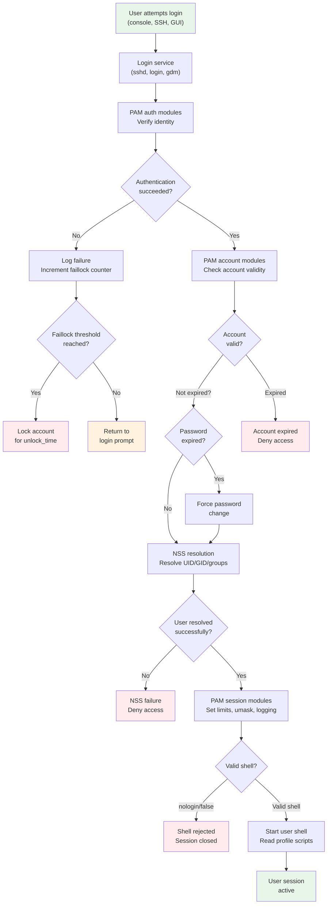

# 11 - Linux Authentication and Password Management

## Table of Contents

- [Introduction](#introduction)
- [Authentication Flow Overview](#authentication-flow-overview)
- [Password Management](#password-management)
- [Password Hashing in Detail](#password-hashing-in-detail)
- [Password Aging with chage](#password-aging-with-chage)
- [Account States - Critical Distinctions](#account-states---critical-distinctions)
- [PAM - Pluggable Authentication Modules](#pam---pluggable-authentication-modules)
- [NSS - Name Service Switch](#nss---name-service-switch)
- [faillock - Account Lockout](#faillock---account-lockout)
- [Password Quality with pam_pwquality](#password-quality-with-pam_pwquality)
- [Login Troubleshooting Flow](#login-troubleshooting-flow)
- [Authentication Flow Diagram](#authentication-flow-diagram)
- [Interview Questions](#interview-questions)

---

## Introduction

Linux authentication is the process of verifying a user's identity before granting access to the system. It involves multiple subsystems working together: PAM (Pluggable Authentication Modules), NSS (Name Service Switch), password management, and various security mechanisms.

Understanding authentication is essential for Linux system administrators -- it directly affects system security, user experience, and troubleshooting ability. This guide covers authentication on **AlmaLinux 9 / RHEL 9**, noting differences for Ubuntu/Debian.

---

## Authentication Flow Overview

When a user attempts to log in to a Linux system, the following sequence occurs:

### Step 1: User Provides Credentials

The user provides their identity (username) and proof of identity (password, SSH key, certificate, etc.) through a login interface:
- Local console login (getty/agetty)
- SSH remote login (sshd)
- Graphical login (GDM, SDDM)
- sudo or su
- Application-specific (web apps, databases)

### Step 2: PAM Processes the Authentication Stack

The login service (sshd, login, gdm, etc.) calls PAM to handle authentication. PAM reads the service-specific configuration file from `/etc/pam.d/` and processes the module stack in order:

1. **auth** modules -- verify the user's identity (check password, key, etc.)
2. **account** modules -- check if the account is valid (not expired, not locked, etc.)
3. **password** modules -- handle password changes (strength checks, history)
4. **session** modules -- set up the user's session (limits, umask, home directory, logging)

### Step 3: NSS Resolves User Identity

The Name Service Switch (NSS) resolves the username to a UID, determines group memberships, and retrieves user information. NSS checks sources in the order configured in `/etc/nsswitch.conf`:
- `files` -- /etc/passwd, /etc/group, /etc/shadow
- `sss` -- SSSD (System Security Services Daemon) for LDAP/AD/IPA
- `ldap` -- Direct LDAP lookups
- `nis` -- NIS/NIS+ (legacy)

### Step 4: Session Is Established

After successful authentication and account validation:
- PAM session modules run (set resource limits, log the login, create utmp/wtmp entries)
- The user's home directory is verified (or created if pam_mkhomedir is configured)
- Environment variables are set
- The user's shell is started

### Step 5: Shell Is Started

The system starts the user's configured shell (from /etc/passwd):
- Login shells read profile scripts (/etc/profile, ~/.bash_profile)
- Non-login shells read rc files (~/.bashrc)

---

## Password Management

### Where Passwords Are Stored

On modern Linux systems, password hashes are stored in `/etc/shadow`, not in `/etc/passwd`. This separation was introduced because `/etc/passwd` must be world-readable (many programs need to resolve UIDs to usernames), but password hashes should be protected.

**`/etc/passwd`** -- world-readable, contains user account information:
```
akshay:x:1000:1000:Akshay Rathod:/home/akshay:/bin/bash
```

The `x` in the password field indicates that the actual hash is in /etc/shadow.

**`/etc/shadow`** -- readable only by root (mode 0000 on RHEL 9), contains password hashes and aging information:
```
akshay:$y$j9T$SALT$HASH:19723:0:99999:7:::
```

### /etc/shadow Field Format

Each line in /etc/shadow has 9 colon-separated fields:

```
username:password_hash:last_changed:min_days:max_days:warn_days:inactive_days:expire_date:reserved
```

| Field | Description | Example |
|-------|-------------|---------|
| 1. username | Login name | `akshay` |
| 2. password_hash | Encrypted password hash | `$y$j9T$...` |
| 3. last_changed | Days since Jan 1, 1970 when password was last changed | `19723` |
| 4. min_days | Minimum days between password changes | `0` |
| 5. max_days | Maximum days before password must be changed | `99999` |
| 6. warn_days | Days before expiry to warn user | `7` |
| 7. inactive_days | Days after expiry before account is locked | (empty) |
| 8. expire_date | Days since Jan 1, 1970 when account expires | (empty) |
| 9. reserved | Reserved for future use | (empty) |

### Special Values in the Password Field

| Value | Meaning |
|-------|---------|
| `$y$j9T$SALT$HASH` | Valid password hash (yescrypt) |
| `$6$SALT$HASH` | Valid password hash (SHA-512) |
| `!!` | Account has never had a password set |
| `!` | Account is locked (password disabled) |
| `!$6$SALT$HASH` | Password is locked (! prepended to hash) |
| `*` | Account does not use password authentication |
| (empty) | No password required -- DANGEROUS |

### The passwd Command

The `passwd` command is the primary tool for managing passwords:

```bash
# Change your own password
passwd

# Change another user's password (requires root)
sudo passwd username

# Lock a user's password (prepends ! to hash)
sudo passwd -l username

# Unlock a user's password (removes the !)
sudo passwd -u username

# Delete a user's password (allows passwordless login -- DANGEROUS)
sudo passwd -d username

# Check password status
sudo passwd -S username
# Output: username PS 2024-01-15 0 99999 7 -1 (Password set, SHA512 crypt.)

# Force password change on next login
sudo passwd -e username

# Set minimum and maximum days
sudo passwd -n 7 -x 90 username
```

### passwd -S Output Explained

```bash
$ sudo passwd -S akshay
akshay PS 2024-01-15 0 99999 7 -1 (Password set, yescrypt crypt.)
```

| Field | Meaning |
|-------|---------|
| `akshay` | Username |
| `PS` | Password Status: PS=set, LK=locked, NP=no password |
| `2024-01-15` | Date password was last changed |
| `0` | Minimum days between changes |
| `99999` | Maximum days before expiry |
| `7` | Warning days before expiry |
| `-1` | Inactive days (-1 = not set) |

---

## Password Hashing in Detail

### Hash Algorithm Identifiers

Linux password hashes use a standardized format with the algorithm identifier as a prefix:

```
$algorithm_id$parameters$salt$hash
```

| ID | Algorithm | Security | Notes |
|----|-----------|----------|-------|
| `$1$` | MD5-crypt | WEAK -- do not use | 1000 iterations, fast to crack |
| `$5$` | SHA-256 | Good | Configurable rounds (default 5000) |
| `$6$` | SHA-512 | Good | Configurable rounds (default 5000), RHEL 7-8 default |
| `$y$` | yescrypt | Best | Memory-hard, RHEL 9 default, resistant to GPU attacks |
| `$2b$` | bcrypt | Good | Not commonly used on Linux |

### Example Hash Formats

```
# MD5-crypt (DO NOT USE)
$1$aBcDeFgH$ijklmnopqrstuvwxyz1234

# SHA-512 (RHEL 7/8 default)
$6$rounds=5000$aBcDeFgHiJkLmNoP$veryLongHashStringHere...

# yescrypt (RHEL 9 / AlmaLinux 9 default)
$y$j9T$aBcDeFgHiJkLmNoP$veryLongHashStringHere...
```

### What Is a Salt?

A **salt** is a random string appended to the password BEFORE hashing. It ensures that:

1. **Two users with the same password get different hashes** -- without salt, if Alice and Bob both use "password123", their hashes would be identical, revealing that they use the same password. With salt, each gets a unique hash.

2. **Pre-computed hash tables (rainbow tables) are ineffective** -- an attacker cannot pre-compute hashes for common passwords because they would need a separate rainbow table for every possible salt value.

3. **Dictionary attacks must be performed per-user** -- the attacker must hash each candidate password with EACH user's unique salt, making mass cracking much slower.

```
# Same password, different salts, completely different hashes:
password123 + salt "abc" = hash_1
password123 + salt "xyz" = hash_2
# hash_1 and hash_2 look completely different
```

### Why yescrypt (RHEL 9 Default)?

yescrypt is a **memory-hard** password hashing function. This means:

- It requires a significant amount of RAM to compute each hash
- GPU-based cracking is much harder because GPUs have limited per-core memory
- ASIC/FPGA attacks are also more difficult and expensive
- It provides configurable time and memory parameters

Traditional algorithms like SHA-512 are CPU-bound -- they can be massively parallelized on GPUs. yescrypt's memory requirements limit parallelism, making brute-force attacks much more expensive.

### Checking and Changing the Default Algorithm

```bash
# Check current default algorithm (RHEL 9)
sudo authselect current

# Check PAM configuration for password hashing
grep pam_unix /etc/pam.d/system-auth
# Should show: password sufficient pam_unix.so ... yescrypt

# On older systems, check /etc/login.defs
grep ENCRYPT_METHOD /etc/login.defs
# ENCRYPT_METHOD SHA512    (RHEL 8)
# ENCRYPT_METHOD YESCRYPT  (RHEL 9)
```

> **Ubuntu/Debian note:** Ubuntu 22.04+ uses yescrypt by default. Older versions use SHA-512. The configuration is in `/etc/pam.d/common-password`.

---

## Password Aging with chage

The `chage` command manages password aging policies. It controls when passwords expire, when users are warned, and when accounts become inactive.

### chage Options

| Option | Description | Example |
|--------|-------------|---------|
| `-l` | List aging information | `chage -l akshay` |
| `-m DAYS` | Minimum days between password changes | `chage -m 7 akshay` |
| `-M DAYS` | Maximum days before password must change | `chage -M 90 akshay` |
| `-W DAYS` | Warning days before expiry | `chage -W 14 akshay` |
| `-I DAYS` | Inactive days after expiry before lock | `chage -I 30 akshay` |
| `-E DATE` | Account expiration date (YYYY-MM-DD) | `chage -E 2025-12-31 akshay` |
| `-d DAYS` | Set last password change date | `chage -d 0 akshay` (force change) |

### Listing Password Aging Information

```bash
$ sudo chage -l akshay
Last password change                                   : Jan 15, 2024
Password expires                                       : never
Password inactive                                      : never
Account expires                                        : never
Minimum number of days between password change          : 0
Maximum number of days between password change          : 99999
Number of days of warning before password expires       : 7
```

### Setting a Comprehensive Password Policy

```bash
# Set minimum 7 days between changes (prevents rapid cycling)
sudo chage -m 7 akshay

# Set maximum 90 days (force change every 90 days)
sudo chage -M 90 akshay

# Warn 14 days before expiry
sudo chage -W 14 akshay

# Lock account 30 days after password expires (grace period)
sudo chage -I 30 akshay

# Verify
sudo chage -l akshay
```

### Forcing Password Change on Next Login

```bash
# Method 1: Set last change date to 0 (epoch)
sudo chage -d 0 akshay

# Method 2: Use passwd -e
sudo passwd -e akshay

# When akshay logs in next:
# WARNING: Your password has expired.
# You must change your password now and login again!
# Changing password for user akshay.
# Current password:
# New password:
```

### Setting Account Expiration Date

```bash
# Account expires on December 31, 2025
sudo chage -E 2025-12-31 akshay

# Account expires immediately (set to date in the past)
sudo chage -E 1 akshay
# Note: -E 1 means day 1 since epoch (Jan 2, 1970), effectively immediately

# Remove account expiration
sudo chage -E -1 akshay

# Alternative: use usermod
sudo usermod -e 2025-12-31 akshay
```

### How chage Fields Map to /etc/shadow

```
akshay:$y$...:19723:7:90:14:30:20454:
         ^      ^    ^  ^  ^  ^   ^
         |      |    |  |  |  |   |
         |      |    |  |  |  |   +-- Field 8: Account expire date (days since epoch)
         |      |    |  |  |  +------ Field 7: Inactive days after password expiry
         |      |    |  |  +--------- Field 6: Warning days before password expiry
         |      |    |  +------------ Field 5: Maximum days between changes
         |      |    +--------------- Field 4: Minimum days between changes
         |      +-------------------- Field 3: Last password change (days since epoch)
         +--------------------------- Field 2: Password hash
```

| chage option | /etc/shadow field | Description |
|---|---|---|
| `-d` | Field 3 | Last password change date |
| `-m` | Field 4 | Minimum days between changes |
| `-M` | Field 5 | Maximum days before change required |
| `-W` | Field 6 | Warning days before expiry |
| `-I` | Field 7 | Inactive days after expiry |
| `-E` | Field 8 | Account expiration date |

---

## Account States - Critical Distinctions

Understanding the different states a Linux account can be in is CRITICAL. These states are often confused, but they have very different effects. Misunderstanding them can lead to security vulnerabilities.

### 1. Active Account

**State:** Normal, fully functional account.

**Characteristics:**
- Valid password hash in /etc/shadow
- No lock prefix (! or !!) in shadow
- Account not expired
- Password not expired
- Valid login shell
- Can authenticate via password, SSH keys, or other methods

```bash
# Check: Active account looks like this
$ sudo passwd -S akshay
akshay PS 2024-01-15 0 99999 7 -1 (Password set, yescrypt crypt.)
```

### 2. Password Locked Account

**State:** Password authentication is disabled, but the account still exists and OTHER authentication methods still work.

**Characteristics:**
- `!` is prepended to the password hash in /etc/shadow
- Password authentication FAILS
- SSH key authentication STILL WORKS
- Kerberos authentication may STILL WORK
- The account is NOT disabled -- it just cannot authenticate via password

```bash
# Lock the password
sudo passwd -l akshay
# Or: sudo usermod -L akshay

# The shadow file now shows:
# akshay:!$y$j9T$...:19723:0:99999:7:::
#         ^ note the ! prefix

# Check status
sudo passwd -S akshay
# akshay LK 2024-01-15 0 99999 7 -1 (Password locked.)

# Unlock the password
sudo passwd -u akshay
# Or: sudo usermod -U akshay
```

> **CRITICAL SECURITY POINT:** Locking a password does NOT prevent SSH key-based login. If you need to completely prevent a user from logging in, you must also:
> - Remove their SSH authorized_keys
> - Set account expiry: `sudo usermod -e 1 username`
> - Change their shell: `sudo usermod -s /sbin/nologin username`
> - Use DenyUsers in sshd_config

### 3. Account Expired

**State:** The account is completely unusable after the specified date. No authentication method works.

**Characteristics:**
- The expire date in /etc/shadow (field 8) is in the past
- ALL login methods are blocked (password, SSH keys, everything)
- The user sees: "Your account has expired; please contact your system administrator"
- This is the most thorough way to disable an account

```bash
# Set account expiry (expire immediately)
sudo usermod -e 1 akshay
# Or: sudo chage -E 1 akshay

# Set account to expire on a future date
sudo chage -E 2025-06-30 akshay

# Check
sudo chage -l akshay
# Account expires: Jun 30, 2025

# Remove expiry (re-enable)
sudo chage -E -1 akshay
# Or: sudo usermod -e "" akshay
```

### 4. Password Expired

**State:** The password's maximum age has been exceeded. The user is forced to change their password at next login. The account is NOT disabled.

**Characteristics:**
- The user CAN still log in
- They are IMMEDIATELY prompted to change their password
- They cannot do anything until the password is changed
- SSH key authentication may or may not prompt for password change (depends on sshd configuration)

```bash
# Force password expiry (user must change on next login)
sudo passwd -e akshay
# Or: sudo chage -d 0 akshay

# Check
sudo chage -l akshay
# Password expires: password must be changed

# What the user sees on login:
# WARNING: Your password has expired.
# You must change your password now and login again!
```

### 5. No Password Set

**State:** The password field is empty, allowing login without any password. This is EXTREMELY DANGEROUS.

**Characteristics:**
- The password field in /etc/shadow is empty
- Anyone can log in as this user without a password
- Some services (like SSH) may block passwordless login by default

```bash
# Delete a user's password (DANGEROUS -- do not do this in production)
sudo passwd -d akshay

# Check
sudo passwd -S akshay
# akshay NP 2024-01-15 0 99999 7 -1 (Empty password.)

# The shadow file shows:
# akshay::19723:0:99999:7:::
#        ^^ empty password field
```

> **WARNING:** Never delete a user's password in production. If a user should not have a password (e.g., service account), set their shell to /sbin/nologin and lock the password.

### 6. Invalid Shell (nologin, false)

**State:** The user account exists but cannot get an interactive shell. The account may still be used for running services.

**Characteristics:**
- Shell is set to `/sbin/nologin` or `/bin/false`
- Interactive login (console, SSH) is blocked
- The user sees "This account is currently not available" (nologin) or nothing (false)
- Services running as this user still work (they do not need a shell)
- Password authentication technically succeeds but the session is immediately terminated

```bash
# Set shell to nologin
sudo usermod -s /sbin/nologin akshay

# Set shell to false
sudo usermod -s /bin/false akshay

# Check
getent passwd akshay
# akshay:x:1000:1000::/home/akshay:/sbin/nologin

# Difference between nologin and false:
# /sbin/nologin -- displays a message: "This account is currently not available."
# /bin/false -- silently exits with status 1
```

`/sbin/nologin` is preferred for service accounts because it provides a clear message if someone attempts to log in.

### 7. SSH Denied (sshd_config)

**State:** The user exists and can log in locally, but SSH remote login is specifically denied.

**Characteristics:**
- sshd_config contains AllowUsers or DenyUsers directives
- The user CAN still log in at the local console
- The user CAN still use su or sudo
- Only SSH access is affected

```bash
# In /etc/ssh/sshd_config:

# Allow only specific users (everyone else is denied)
AllowUsers alice bob charlie

# Or deny specific users (everyone else is allowed)
DenyUsers guest contractor01

# Group-based control
AllowGroups wheel sshusers
DenyGroups contractors

# After changing sshd_config:
sudo systemctl restart sshd
```

### Comparison Table

| State | Password Login | SSH Key Login | Console Login | Services Run? |
|-------|---------------|---------------|---------------|---------------|
| Active | Yes | Yes | Yes | Yes |
| Password Locked | No | YES | No (password) | Yes |
| Account Expired | No | No | No | Depends |
| Password Expired | Change required | Depends | Change required | Yes |
| No Password | Yes (no prompt) | Yes | Yes | Yes |
| Invalid Shell | Blocked | Blocked | Blocked | Yes |
| SSH Denied | N/A | N/A | Yes | Yes |

### Why These Distinctions Matter

**Scenario:** You want to disable a departing employee's access.

**WRONG approach -- just lock the password:**
```bash
sudo passwd -l employee
# PROBLEM: Employee can still log in via SSH keys!
```

**CORRECT approach -- multi-layered:**
```bash
# 1. Lock the password
sudo passwd -l employee

# 2. Expire the account (blocks ALL authentication)
sudo usermod -e 1 employee

# 3. Kill active sessions
sudo pkill -u employee

# 4. Remove SSH keys
sudo rm /home/employee/.ssh/authorized_keys

# 5. Change shell (belt and suspenders)
sudo usermod -s /sbin/nologin employee
```

---

## PAM - Pluggable Authentication Modules

### What Is PAM?

PAM (Pluggable Authentication Modules) is a framework that allows Linux to use different authentication methods without modifying the applications that need authentication. Instead of each program implementing its own authentication logic, they delegate to PAM, which handles it through a configurable stack of modules.

**Without PAM:** Every application (sshd, login, su, sudo, gdm, etc.) would need to implement password checking, account locking, LDAP integration, two-factor authentication, etc. independently.

**With PAM:** Applications call PAM, and PAM reads a configuration file that specifies which modules to use and in what order. Adding a new authentication method (like LDAP or MFA) means adding a PAM module -- no application changes needed.

### PAM Module Types

PAM modules are organized into four types (also called "module interfaces"):

| Type | Purpose | When It Runs |
|------|---------|-------------|
| **auth** | Verify user identity (password, key, token) | During login/authentication |
| **account** | Check if account is valid (expired? locked? allowed?) | After authentication |
| **password** | Handle password changes (strength, history) | When password is changed |
| **session** | Set up/tear down session (limits, logging, home dir) | At login/logout |

Each type runs at a different phase:
```
Login attempt
    |
    v
auth modules ---------> Verify identity (check password)
    |
    v
account modules -------> Validate account (not expired, not locked)
    |
    v
[session established]
    |
    v
session modules -------> Set up session (limits, umask, logging)

Password change
    |
    v
password modules ------> Validate new password (strength, history)
```

### PAM Control Flags

Control flags determine what happens when a module succeeds or fails:

| Flag | Behavior |
|------|----------|
| **required** | Must succeed for overall success. If it fails, processing CONTINUES (other modules run) but the final result will be failure. |
| **requisite** | Must succeed. If it fails, processing STOPS IMMEDIATELY and returns failure. |
| **sufficient** | If it succeeds (and no previous required modules failed), processing STOPS and returns success. If it fails, it is ignored. |
| **optional** | Result is only used if no other modules of this type have a definitive result. |
| **include** | Include the rules from another PAM configuration file. |
| **substack** | Like include, but failures in the substack only affect the substack. |

**Visualization of control flow:**

```
Module 1 (required)   --> FAIL --> continue but mark overall as "will fail"
Module 2 (requisite)  --> FAIL --> STOP immediately, return failure
Module 3 (sufficient) --> PASS --> STOP immediately, return success (if no prior required failures)
Module 4 (optional)   --> FAIL --> ignored (unless it's the only module)
```

### Important PAM Modules

#### pam_unix -- Traditional Password Authentication

Handles standard Unix password checking against /etc/shadow:

```
auth     required  pam_unix.so
account  required  pam_unix.so
password required  pam_unix.so yescrypt shadow
session  required  pam_unix.so
```

#### pam_pwquality -- Password Strength Enforcement

Checks that new passwords meet complexity requirements:

```
password requisite pam_pwquality.so retry=3 minlen=12 dcredit=-1 ucredit=-1 lcredit=-1 ocredit=-1
```

Configuration in `/etc/security/pwquality.conf`:
```
# Minimum password length
minlen = 12

# Require at least 1 digit
dcredit = -1

# Require at least 1 uppercase
ucredit = -1

# Require at least 1 lowercase
lcredit = -1

# Require at least 1 special character
ocredit = -1

# Minimum number of character classes (digits, upper, lower, special)
minclass = 3

# Maximum consecutive identical characters
maxrepeat = 3

# Maximum sequential characters (abc, 123)
maxsequence = 3

# Reject passwords containing the username
usercheck = 1

# Minimum characters that must differ from old password
difok = 5
```

#### pam_faillock -- Account Lockout After Failed Attempts

Locks accounts after a configurable number of failed login attempts:

```
auth     required  pam_faillock.so preauth silent deny=5 unlock_time=900
auth     required  pam_faillock.so authfail deny=5 unlock_time=900
account  required  pam_faillock.so
```

Configuration in `/etc/security/faillock.conf` (RHEL 9):
```
# Lock after 5 failed attempts
deny = 5

# Unlock after 900 seconds (15 minutes)
unlock_time = 900

# Count failures within this window (seconds)
fail_interval = 900

# Even lock root account (default: no)
even_deny_root = false

# Root unlock time (if even_deny_root is set)
root_unlock_time = 60

# Directory for failure records
dir = /var/run/faillock
```

#### pam_limits -- Resource Limits

Sets resource limits for user sessions:

```
session  required  pam_limits.so
```

Configured in `/etc/security/limits.conf`:
```
# Format: domain type item value

# Limit max open files for all users
*        soft    nofile    1024
*        hard    nofile    65536

# Limit max processes for regular users
*        soft    nproc     4096
*        hard    nproc     8192

# Unlimited for admin group
@wheel   soft    nproc     unlimited
@wheel   hard    nproc     unlimited

# Specific user limits
postgres soft    nofile    8192
postgres hard    nofile    16384
```

#### pam_access -- Login Access Control

Controls which users can log in from which locations:

```
account  required  pam_access.so
```

Configured in `/etc/security/access.conf`:
```
# Format: permission : users : origins

# Allow root only from console
+ : root : LOCAL

# Allow wheel group from anywhere
+ : @wheel : ALL

# Deny everyone else
- : ALL : ALL
```

#### pam_nologin -- Prevent Non-Root Logins

If `/etc/nologin` or `/var/run/nologin` exists, non-root users cannot log in:

```
account  required  pam_nologin.so
```

Usage (for maintenance):
```bash
# Create nologin file to prevent logins
echo "System maintenance in progress. Please try again later." | sudo tee /etc/nologin

# Remove to allow logins again
sudo rm /etc/nologin
```

#### pam_umask -- Set Default umask

Sets the default file creation mask for user sessions:

```
session  optional  pam_umask.so umask=0027
```

### PAM Configuration Files

PAM configuration files are in `/etc/pam.d/`:

```bash
$ ls /etc/pam.d/
atd              gdm-password     password-auth    smartcard-auth     sudo
crond            login            polkit-1         smtp               sudo-i
fingerprint-auth other            postlogin        sshd               system-auth
gdm-autologin    passwd           runuser          su                 systemd-user
```

Each file contains rules for a specific service:

```bash
$ cat /etc/pam.d/sshd
#%PAM-1.0
auth       substack     password-auth
auth       include      postlogin
account    required     pam_sepermit.so
account    required     pam_nologin.so
account    include      password-auth
password   include      password-auth
session    required     pam_selinux.so close
session    required     pam_loginuid.so
session    required     pam_selinux.so open env_params
session    required     pam_namespace.so
session    optional     pam_keyinit.so force revoke
session    optional     pam_motd.so
session    include      password-auth
session    include      postlogin
```

### Common PAM Configuration Files on RHEL 9

| File | Purpose |
|------|---------|
| `/etc/pam.d/system-auth` | Default authentication rules (included by most services) |
| `/etc/pam.d/password-auth` | Authentication rules for password-based services |
| `/etc/pam.d/sshd` | SSH daemon authentication |
| `/etc/pam.d/login` | Console login |
| `/etc/pam.d/sudo` | sudo authentication |
| `/etc/pam.d/su` | su command |
| `/etc/pam.d/postlogin` | Post-login processing |

> **Ubuntu/Debian difference:** Debian-based systems use `/etc/pam.d/common-auth`, `/etc/pam.d/common-account`, `/etc/pam.d/common-password`, and `/etc/pam.d/common-session` instead of system-auth and password-auth.

### authselect (RHEL 9)

RHEL 9 uses **authselect** to manage PAM and NSS configuration. Do NOT manually edit PAM files on RHEL 9 -- use authselect instead:

```bash
# List available profiles
authselect list

# Check current profile
authselect current

# Select a profile
sudo authselect select sssd with-mkhomedir with-faillock

# Enable features
sudo authselect enable-feature with-faillock
sudo authselect enable-feature with-mkhomedir

# Check which features are enabled
authselect current
```

> **WARNING:** Directly editing PAM configuration files can lock everyone out of the system. On RHEL 9, always use authselect. On Ubuntu/Debian, use pam-auth-update. If you must edit PAM files manually, always keep a root shell open for recovery.

---

## NSS - Name Service Switch

### What Is NSS?

The Name Service Switch (NSS) determines where the system looks up user, group, host, and other system information. It acts as a routing layer between applications that need identity information and the sources of that information.

### /etc/nsswitch.conf

```bash
$ cat /etc/nsswitch.conf
passwd:     files sss
shadow:     files sss
group:      files sss
hosts:      files dns myhostname
```

Each line specifies a database and the sources to search, in order:

| Database | Description | Common Sources |
|----------|-------------|----------------|
| `passwd` | User accounts | files, sss, ldap |
| `shadow` | Password hashes | files, sss |
| `group` | Groups | files, sss, ldap |
| `hosts` | Hostnames | files, dns, myhostname |
| `networks` | Network names | files |
| `services` | Network services (/etc/services) | files |
| `protocols` | Network protocols | files |

### Source Types

| Source | Description |
|--------|-------------|
| `files` | Local files (/etc/passwd, /etc/group, /etc/shadow) |
| `sss` | SSSD (System Security Services Daemon) -- connects to LDAP, AD, IPA |
| `ldap` | Direct LDAP lookups |
| `nis` | NIS/NIS+ (legacy, rarely used) |
| `dns` | DNS lookups (for hosts) |
| `myhostname` | systemd module for local hostname resolution |

### How NSS Resolution Works

When an application needs to resolve a username (e.g., `getent passwd akshay`), NSS processes sources left to right:

```
passwd: files sss

Step 1: Check /etc/passwd (files)
  - Found? Return result.
  - Not found? Continue.

Step 2: Check SSSD (sss)  
  - Found? Return result.
  - Not found? Return "not found."
```

### Testing NSS Resolution

```bash
# Look up a user through NSS
getent passwd akshay
# akshay:x:1000:1000:Akshay Rathod:/home/akshay:/bin/bash

# Look up a group
getent group wheel
# wheel:x:10:akshay

# Look up all users (from all sources)
getent passwd

# Look up from a specific source only
getent passwd -s files akshay    # Only check local files
getent passwd -s sss akshay      # Only check SSSD

# Check if user exists
id akshay
# uid=1000(akshay) gid=1000(akshay) groups=1000(akshay),10(wheel)
```

### Impact on Login

If NSS cannot resolve a username, the user cannot log in -- even if their password is correct. This can happen when:
- LDAP/AD server is unreachable and there is no local account
- SSSD is not running or misconfigured
- nsswitch.conf is misconfigured
- Name resolution timeouts

```bash
# Troubleshoot NSS issues
getent passwd username                # Does the user resolve?
id username                          # Check user and group info
systemctl status sssd                 # Is SSSD running?
sudo sssctl domain-status <domain>    # Check SSSD domain status
```

---

## faillock - Account Lockout

### Overview

`faillock` is the modern account lockout mechanism on RHEL 9 / AlmaLinux 9 (replacing the older `pam_tally2`). It tracks failed login attempts and locks accounts after a configurable threshold.

### Configuration

On RHEL 9, faillock is configured in `/etc/security/faillock.conf`:

```
# Lock after 5 failed attempts
deny = 5

# Unlock after 900 seconds (15 minutes)
unlock_time = 900

# Count failures within this window (seconds)
fail_interval = 900

# Lock root account too? (default: false)
even_deny_root = false

# Root unlock time (if even_deny_root is true)
root_unlock_time = 60

# Write failure records to this directory
dir = /var/run/faillock

# Audit failed attempts
audit

# Silent mode (don't show number of failed attempts)
silent
```

Enable faillock with authselect:
```bash
sudo authselect enable-feature with-faillock
```

### Managing faillock

```bash
# Check failed attempts for a user
faillock --user akshay

# Example output:
# akshay:
# When                Type  Source                          Valid
# 2024-01-15 10:30:45 RHOST 192.168.1.100                  V
# 2024-01-15 10:30:50 RHOST 192.168.1.100                  V
# 2024-01-15 10:30:55 RHOST 192.168.1.100                  V

# Reset (unlock) a locked account
faillock --user akshay --reset

# Check all users
faillock
```

### How It Works

1. User enters wrong password -- failure recorded
2. After `deny` failures within `fail_interval` -- account is locked
3. Account stays locked for `unlock_time` seconds
4. After `unlock_time`, the failure counter resets and the account is unlocked
5. Administrator can manually reset with `faillock --user username --reset`

> **Ubuntu/Debian note:** Ubuntu uses `pam_faillock` as well (since 22.04), but older versions may use `pam_tally2`. The configuration location and syntax differ.

---

## Password Quality with pam_pwquality

### Configuration

Password quality rules are configured in `/etc/security/pwquality.conf`:

```bash
# Minimum password length (default: 8)
minlen = 12

# Minimum number of character classes required (default: 0)
# Classes: uppercase, lowercase, digit, special
minclass = 3

# Require at least N digits (negative value = required count)
dcredit = -1

# Require at least N uppercase letters
ucredit = -1

# Require at least N lowercase letters
lcredit = -1

# Require at least N special characters
ocredit = -1

# Maximum consecutive identical characters (0 = disabled)
maxrepeat = 3

# Maximum sequential characters (abc, 123)
maxsequence = 3

# Check if password contains username
usercheck = 1

# Check if password is a dictionary word
dictcheck = 1

# Number of characters that must differ from old password
difok = 5

# Check for palindromes
palindrome = 1

# Reject passwords shorter than this, regardless of credits
# (enforced even for root)
enforcing = 1

# Number of retries before returning an error
retry = 3
```

### Testing Password Quality

```bash
# When changing a password, pam_pwquality checks automatically:
$ passwd
Changing password for user akshay.
Current password:
New password: password123
BAD PASSWORD: The password fails the dictionary check - it is based on a dictionary word

New password: Abc123!@#xyz
BAD PASSWORD: The password is shorter than 12 characters

New password: R4nd0m$ecure!Pass
passwd: all authentication tokens updated successfully.
```

### Checking Current Policy

```bash
# View the pwquality configuration
cat /etc/security/pwquality.conf

# On RHEL 9, also check PAM config
grep pam_pwquality /etc/pam.d/system-auth
```

---

## Login Troubleshooting Flow

When a user cannot log in, follow this systematic troubleshooting approach:

### Scenario 1: Wrong Password

**Symptoms:** "Login incorrect" or "Permission denied" at password prompt.

**Diagnostic commands:**
```bash
# Check if user exists
getent passwd username
id username

# Check password status
sudo passwd -S username

# Check for failed attempts (lockout)
faillock --user username

# Check logs
sudo journalctl -t sshd --since "10 minutes ago"   # For SSH
sudo tail -20 /var/log/secure                        # RHEL
sudo tail -20 /var/log/auth.log                      # Ubuntu
```

**Common causes and solutions:**
- Caps lock is on -- toggle off
- Wrong keyboard layout -- check locale/keyboard settings
- Password was changed and user does not know new password -- reset with `sudo passwd username`
- Account is locked by faillock -- `faillock --user username --reset`

### Scenario 2: Expired Password

**Symptoms:** User logs in but is immediately prompted to change password. If they cannot change it (e.g., SSH without terminal), login fails.

**Diagnostic commands:**
```bash
sudo chage -l username
# Look for: "Password expires: [date in the past]"
# Or: "Password must be changed"
```

**Solution:**
```bash
# Reset the password age
sudo chage -d $(date +%Y-%m-%d) username

# Or set a new password (resets the change date automatically)
sudo passwd username

# Or extend the maximum days
sudo chage -M 180 username
```

### Scenario 3: Expired Account

**Symptoms:** "Your account has expired; please contact your system administrator."

**Diagnostic commands:**
```bash
sudo chage -l username
# Look for: "Account expires: [date in the past]"
```

**Solution:**
```bash
# Remove account expiry
sudo chage -E -1 username

# Or set a future date
sudo chage -E 2026-12-31 username
```

### Scenario 4: Locked Account

**Symptoms:** Password prompt appears but always fails, even with correct password.

**Diagnostic commands:**
```bash
# Check password status
sudo passwd -S username
# Look for: "LK" (locked)

# Check faillock
faillock --user username
# Look for multiple failure entries

# Check shadow file
sudo grep username /etc/shadow
# Look for: ! or !! at start of password field
```

**Solution:**
```bash
# If locked by passwd -l / usermod -L:
sudo passwd -u username

# If locked by faillock:
faillock --user username --reset

# If both:
sudo passwd -u username
faillock --user username --reset
```

### Scenario 5: Invalid Shell

**Symptoms:** Login appears to succeed but session immediately closes. Or "This account is currently not available."

**Diagnostic commands:**
```bash
# Check user's shell
getent passwd username
# Look at the last field: /sbin/nologin or /bin/false

# Check valid shells
cat /etc/shells
```

**Solution:**
```bash
# Change to a valid shell
sudo usermod -s /bin/bash username
```

### Scenario 6: PAM Failure

**Symptoms:** Various -- "Authentication failure", "Module is unknown", session setup fails.

**Diagnostic commands:**
```bash
# Check PAM logs
sudo journalctl -t (sshd|login|gdm) --since "10 minutes ago"
sudo tail -50 /var/log/secure            # RHEL
sudo tail -50 /var/log/auth.log          # Ubuntu

# Check PAM configuration
cat /etc/pam.d/sshd
cat /etc/pam.d/system-auth               # RHEL
cat /etc/pam.d/common-auth               # Ubuntu

# Validate PAM modules exist
ls -la /usr/lib64/security/              # RHEL
ls -la /usr/lib/x86_64-linux-gnu/security/  # Ubuntu
```

**Solution:** Fix the PAM configuration. If you are locked out, boot to single-user mode. On RHEL 9, use `authselect select sssd --force` to reset PAM to a known-good configuration.

### Scenario 7: NSS Failure

**Symptoms:** "User unknown", commands like `id` and `getent` return nothing for the user.

**Diagnostic commands:**
```bash
# Test NSS resolution
getent passwd username
id username

# Check nsswitch.conf
cat /etc/nsswitch.conf

# Check if SSSD is running (if using SSSD)
systemctl status sssd

# Test specific NSS sources
getent passwd -s files username     # Local files only
getent passwd -s sss username       # SSSD only
```

**Solution:**
```bash
# If SSSD is the issue:
sudo systemctl restart sssd
sudo sssctl cache-remove
sudo systemctl restart sssd

# If nsswitch.conf is wrong:
# Ensure correct order: files sss (or files ldap)
```

### Scenario 8: SSH-Specific Failure

**Symptoms:** Local login works but SSH fails. "Permission denied (publickey,gssapi-keyex,gssapi-with-mic,password)."

**Diagnostic commands:**
```bash
# Check sshd_config
sudo grep -E 'AllowUsers|DenyUsers|AllowGroups|DenyGroups|PermitRootLogin|PasswordAuthentication' /etc/ssh/sshd_config

# Check SSH key permissions
ls -la /home/username/.ssh/
ls -la /home/username/.ssh/authorized_keys
# authorized_keys must be: 0600 or 0644, owned by the user
# .ssh directory must be: 0700, owned by the user

# Check SELinux context (RHEL)
ls -laZ /home/username/.ssh/authorized_keys
# Should be: unconfined_u:object_r:ssh_home_t:s0

# Test SSH with verbose output
ssh -vvv username@hostname

# Check SSH logs
sudo journalctl -u sshd --since "10 minutes ago"
```

**Solution:**
```bash
# Fix SSH key permissions
chmod 700 /home/username/.ssh
chmod 600 /home/username/.ssh/authorized_keys
chown -R username:username /home/username/.ssh

# Fix SELinux context
sudo restorecon -Rv /home/username/.ssh

# If sshd_config restricts access, add user to AllowUsers or AllowGroups
```

### Scenario 9: Home Directory Issues

**Symptoms:** Login succeeds but user sees warnings about home directory. Or session fails to establish.

**Diagnostic commands:**
```bash
# Check if home directory exists
ls -la /home/username

# Check ownership and permissions
stat /home/username
# Should be: drwx------ owned by username:username (mode 700)
```

**Solution:**
```bash
# Create missing home directory
sudo mkdir /home/username
sudo cp -a /etc/skel/. /home/username/
sudo chown -R username:username /home/username
sudo chmod 700 /home/username

# Or use mkhomedir PAM module for automatic creation
# sudo authselect enable-feature with-mkhomedir
```

### Scenario 10: Resource Limits

**Symptoms:** Login succeeds but processes fail with "Resource temporarily unavailable" or "Too many open files."

**Diagnostic commands:**
```bash
# Check current limits (as the user)
ulimit -a

# Check limits configuration
cat /etc/security/limits.conf
ls /etc/security/limits.d/

# Check max user processes
ulimit -u

# Check max open files
ulimit -n
```

**Solution:**
```bash
# Edit limits.conf or create a file in limits.d/
sudo vi /etc/security/limits.d/99-custom.conf

# Increase limits:
username soft nofile 4096
username hard nofile 65536
username soft nproc 4096
username hard nproc 8192
```

---

## Authentication Flow Diagram



---

## Interview Questions

### Q1: Explain the Linux authentication flow from login to shell.

**Answer:** When a user attempts to log in: (1) They provide credentials to a login service (sshd, getty, gdm). (2) The service calls PAM, which processes the auth module stack to verify identity (password check, key verification). (3) PAM's account modules check if the account is valid -- not expired, not locked, within allowed hours. (4) NSS resolves the username to a UID, determines group memberships, and retrieves account information from configured sources (files, SSSD, LDAP). (5) PAM's session modules set up the session -- resource limits, umask, logging, home directory creation. (6) The user's configured shell starts, reading profile scripts for a login shell. If any step fails, login is denied and the failure is logged.

### Q2: What is the difference between /etc/passwd and /etc/shadow?

**Answer:** `/etc/passwd` is world-readable (mode 644) and contains user account information: username, UID, GID, comment, home directory, and shell. The password field contains 'x' indicating the actual hash is in /etc/shadow. `/etc/shadow` is only readable by root (mode 000 on RHEL 9) and contains password hashes and aging information. This separation exists because many programs need to read /etc/passwd to resolve UIDs to usernames, but password hashes should be protected. If hashes were in /etc/passwd, any user could read them and attempt offline cracking.

### Q3: Explain the different password hash algorithms and which is used by default on RHEL 9.

**Answer:** Linux supports multiple hash algorithms, identified by a prefix: $1$ is MD5-crypt (weak, do not use -- fast to crack), $5$ is SHA-256 (good, configurable rounds), $6$ is SHA-512 (good, was the RHEL 7/8 default), and $y$ is yescrypt (best, RHEL 9 default). yescrypt is a memory-hard function, meaning it requires significant RAM to compute each hash. This makes GPU-based and ASIC-based cracking much harder because those devices have limited per-core memory. Traditional algorithms like SHA-512 are CPU-bound and can be massively parallelized on GPUs.

### Q4: What is a password salt and why is it necessary?

**Answer:** A salt is a random string that is combined with the password before hashing. It serves three purposes: (1) Two users with the same password get different hashes, so you cannot tell they share a password. (2) Pre-computed hash tables (rainbow tables) are ineffective because each salt requires a separate table. (3) Dictionary attacks must be performed separately for each user's unique salt, making mass cracking much slower. Without salt, an attacker could pre-compute hashes for millions of common passwords once and instantly look up matches. The salt is stored alongside the hash in /etc/shadow and is not secret -- its purpose is to prevent pre-computation, not to be a secret.

### Q5: What is the difference between a locked account, an expired account, and an expired password?

**Answer:** These are three different states with very different effects. A **locked password** (passwd -l) prepends '!' to the password hash, disabling password authentication -- but SSH key authentication still works. An **expired account** (chage -E or usermod -e) completely disables the account after a date -- ALL authentication methods are blocked, including SSH keys. An **expired password** (when max_days is exceeded) forces the user to change their password at next login but does not prevent login entirely. This distinction is critical for security: simply locking a password does NOT fully disable an account if the user has SSH keys configured.

### Q6: What are the four PAM module types and their purposes?

**Answer:** (1) **auth** modules verify the user's identity -- they check passwords, SSH keys, tokens, or other credentials. (2) **account** modules check if the account is valid -- whether it is expired, locked, within allowed login hours or locations. (3) **password** modules handle password changes -- they enforce quality requirements, check password history, and update the stored hash. (4) **session** modules set up and tear down user sessions -- they set resource limits (ulimit), set umask, create home directories, start/stop logging, and manage session state. Each type runs at a different phase of the login process.

### Q7: Explain PAM control flags: required vs requisite vs sufficient.

**Answer:** **required** means the module must succeed for overall success, but if it fails, PAM continues processing remaining modules (to avoid revealing which module failed) and returns failure at the end. **requisite** means the module must succeed, and if it fails, PAM stops immediately and returns failure -- no more modules are processed. **sufficient** means if this module succeeds (and no previous required modules failed), PAM stops immediately and returns success; if it fails, it is ignored and processing continues. The practical difference: required gives a generic "authentication failed" (more secure), requisite gives immediate feedback, and sufficient allows "short-circuit" success (e.g., if SSSD authenticates the user, skip local password check).

### Q8: How does faillock work and how do you manage it?

**Answer:** faillock tracks failed authentication attempts per user. When the number of failures within `fail_interval` seconds exceeds the `deny` threshold, the account is locked for `unlock_time` seconds. On RHEL 9, it is configured in `/etc/security/faillock.conf` and enabled via `authselect enable-feature with-faillock`. Commands: `faillock --user username` shows failed attempts and lock status. `faillock --user username --reset` clears the counter and unlocks the account. By default, root is NOT locked by faillock (even_deny_root=false) to prevent denial-of-service attacks against the root account.

### Q9: What is NSS and how does it affect login?

**Answer:** NSS (Name Service Switch) is the system that determines where Linux looks up user, group, and host information. Configured in `/etc/nsswitch.conf`, it specifies sources (files, sss, ldap, nis) and their order. For example, `passwd: files sss` means Linux first checks /etc/passwd, then SSSD. If NSS cannot resolve a username, the user cannot log in even if their password is correct. This can happen when: LDAP/AD servers are unreachable and there is no local account, SSSD is not running, or nsswitch.conf is misconfigured. Troubleshoot with `getent passwd username` and `id username`.

### Q10: How would you troubleshoot a user who cannot log in via SSH but can log in at the console?

**Answer:** This is SSH-specific. Check: (1) sshd_config for AllowUsers/DenyUsers/AllowGroups/DenyGroups directives that might exclude the user. (2) PasswordAuthentication setting -- if set to 'no', only key-based auth works. (3) SSH key permissions -- .ssh directory must be 700, authorized_keys must be 600 or 644, owned by the user. (4) SELinux context on .ssh files -- run `restorecon -Rv /home/username/.ssh`. (5) SSH verbose output -- `ssh -vvv user@host` shows exactly where it fails. (6) Server-side logs -- `journalctl -u sshd` or `/var/log/secure`. Common causes: wrong permissions on authorized_keys, SELinux relabeling needed, or user not in AllowUsers list.

### Q11: Explain the chage command and its relationship to /etc/shadow.

**Answer:** `chage` manages password aging policies. Each option maps directly to a field in /etc/shadow: `-d` sets the last password change date (field 3), `-m` sets minimum days between changes (field 4), `-M` sets maximum days before forced change (field 5), `-W` sets warning days before expiry (field 6), `-I` sets inactive days after expiry (field 7), `-E` sets the account expiration date (field 8). `chage -l username` displays all aging information in human-readable format. `chage -d 0` forces a password change on next login by setting the last change date to the epoch.

### Q12: What happens if you edit PAM configuration incorrectly?

**Answer:** Incorrect PAM configuration can lock ALL users (including root) out of the system. For example, setting a required module that always fails, or referencing a module that does not exist, will prevent login. Recovery requires: booting into single-user/rescue mode, using a live CD/USB, or accessing through a hypervisor/IPMI console. Prevention: always keep a root shell open when editing PAM files, use `authselect` on RHEL 9 instead of manual edits, test changes in a non-production environment first, and have a recovery plan before making changes.

### Q13: What is pam_pwquality and how does it enforce password policy?

**Answer:** pam_pwquality is a PAM module that checks password quality when users change their passwords. It enforces rules configured in `/etc/security/pwquality.conf`: minlen (minimum length), dcredit/ucredit/lcredit/ocredit (required digits/uppercase/lowercase/special characters), minclass (minimum character classes), maxrepeat (maximum consecutive identical characters), maxsequence (maximum sequential characters like 'abc'), difok (minimum characters that must differ from old password), dictcheck (reject dictionary words), and usercheck (reject passwords containing the username). The module runs in the password stack and rejects passwords that fail any check, prompting for a new one up to 'retry' times.

### Q14: How do you configure password history to prevent password reuse?

**Answer:** Password history is managed by `pam_pwhistory`. On RHEL 9, add or modify the password line in PAM configuration (via authselect or manually): `password required pam_pwhistory.so remember=12 use_authtok`. The `remember=12` parameter stores the last 12 password hashes, preventing reuse. Old hashes are stored in `/etc/security/opasswd`. Combined with `chage -m 7` (minimum 7 days between changes), this prevents users from rapidly cycling through passwords to get back to their favorite one. On RHEL 9, use authselect to manage this: `authselect enable-feature with-pwhistory`.

### Q15: What is the difference between /sbin/nologin and /bin/false as a shell?

**Answer:** Both prevent interactive login, but they behave differently. `/sbin/nologin` displays the message "This account is currently not available." (or a custom message from /etc/nologin.txt) and then exits. `/bin/false` simply exits with a non-zero status code without any message. `/sbin/nologin` is preferred for service accounts because: (1) it provides a clear message if someone attempts to log in, (2) it is more descriptive in logs, and (3) it is the standard convention. Both are listed in /etc/shells only if they need to be valid FTP shells. Neither prevents the account from running services -- systemd can start services as a user with nologin shell because services do not need an interactive shell.

### Q16: How does authselect differ from directly editing PAM files on RHEL 9?

**Answer:** authselect is a tool on RHEL 9 that manages PAM and NSS configuration through profiles and features. Instead of directly editing files in /etc/pam.d/ (which is error-prone and can lock you out), authselect provides pre-tested configurations. `authselect select sssd` sets up PAM for SSSD authentication. `authselect enable-feature with-faillock` adds faillock support. authselect manages system-auth, password-auth, and other PAM files as a set, ensuring consistency. Direct edits to managed files will be overwritten by authselect. If you need custom PAM configuration, you can create a custom authselect profile. On Ubuntu/Debian, the equivalent tool is `pam-auth-update`.

### Q17: A user reports "Your account has expired" -- walk through the troubleshooting process.

**Answer:** (1) Check account expiry: `sudo chage -l username` -- look at the "Account expires" line. If it shows a date in the past, the account is expired. (2) Check if it was intentional -- review change logs, check if the user was offboarded. (3) If the account should be active, remove the expiry: `sudo chage -E -1 username` or `sudo usermod -e "" username`. (4) Verify: `sudo chage -l username` should show "Account expires: never". (5) Have the user try logging in again. (6) Check who set the expiry and why -- review /var/log/secure for usermod or chage commands. Note: account expiry is different from password expiry. Account expiry blocks ALL access; password expiry only forces a password change.

---

## Summary

| Topic | Key Points |
|-------|------------|
| Authentication flow | Credentials -> PAM auth -> PAM account -> NSS resolution -> PAM session -> Shell |
| Password storage | Hashes in /etc/shadow (not /etc/passwd); RHEL 9 uses yescrypt ($y$) |
| Password aging | Managed by chage; fields map directly to /etc/shadow |
| Account states | Locked password != expired account != expired password; each has different effects |
| PAM | Modular auth framework; 4 types (auth, account, password, session); use authselect on RHEL 9 |
| NSS | Resolves user identity; configured in /etc/nsswitch.conf; files -> sss -> ldap |
| faillock | Locks accounts after N failed attempts; configured in /etc/security/faillock.conf |
| Password quality | pam_pwquality enforces complexity; configured in /etc/security/pwquality.conf |
| Troubleshooting | Systematic approach: check user exists, password status, account state, PAM, NSS, SSH, shell |

---

*Previous: [10 - Advanced sudoers Configuration](10-advanced-sudoers-configuration.md)*
*Next: [12 - User Security and Hardening](12-user-security-and-hardening.md)*
