# Complete Linux System Administration: User Management, Permissions & Sudoers

A comprehensive, hands-on guide to mastering Linux user management, file permissions, and sudo configuration -- built for aspiring and practicing Linux System Administrators.

---

## Table of Contents

- [Overview](#overview)
- [Prerequisites](#prerequisites)
- [Learning Objectives](#learning-objectives)
- [Module List](#module-list)
- [Recommended Learning Path](#recommended-learning-path)
- [How to Set Up a Safe Linux Lab](#how-to-set-up-a-safe-linux-lab)
- [How to Use This Guide](#how-to-use-this-guide)
- [How to Revise for Interviews](#how-to-revise-for-interviews)
- [Progress Checklist](#progress-checklist)
- [Revision Milestones](#revision-milestones)
- [Primary Distribution](#primary-distribution)
- [Total Estimated Study Time](#total-estimated-study-time)

---

## Overview

This guide takes you from the basics of Linux user accounts all the way through production-grade sudoers policies, file permission hardening, and real-world troubleshooting. Every concept is paired with practical examples, hands-on labs, and exercises so you can build genuine confidence -- not just memorize commands.

Whether you are preparing for a junior sysadmin role, studying for the RHCSA, or simply want to understand how Linux access control works under the hood, this guide has you covered. By the end, you will be comfortable managing users, groups, and permissions on any RHEL-family or Debian-family system.

---

## Prerequisites

Before starting this guide, you should have:

- **Basic Linux CLI familiarity** -- You can open a terminal, navigate directories with `cd`, list files with `ls`, and edit files with `vi`, `nano`, or another text editor.
- **A working Linux environment** -- Access to a Linux virtual machine is strongly recommended. AlmaLinux 9 or RHEL 9 is the primary distribution used throughout this guide, but Ubuntu/Debian differences are noted where relevant.
- **Root or sudo access on your practice system** -- Many exercises require administrative privileges. Never practice on a production system.
- **Willingness to break things and fix them** -- The best way to learn system administration is by experimenting, making mistakes, and troubleshooting your way out.

No prior experience with user management or permissions is assumed. The guide starts from first principles and builds up.

---

## Learning Objectives

After completing this guide, you will be able to:

1. **Create, modify, and delete** user accounts and groups using standard Linux commands (`useradd`, `usermod`, `userdel`, `groupadd`, `groupmod`, `groupdel`).
2. **Explain the purpose and format** of critical configuration files: `/etc/passwd`, `/etc/shadow`, `/etc/group`, `/etc/gshadow`, `/etc/login.defs`, and `/etc/skel`.
3. **Read, set, and troubleshoot** standard Linux file permissions (owner, group, other) using both symbolic and octal notation.
4. **Configure umask** values for users and system-wide defaults to control default file and directory permissions.
5. **Apply and manage special permission bits** -- SetUID, SetGID, and the Sticky Bit -- and understand their security implications.
6. **Implement Access Control Lists (ACLs)** with `getfacl` and `setfacl` for fine-grained permission control beyond the traditional owner/group/other model.
7. **Configure sudo access** by editing `/etc/sudoers` safely with `visudo`, including user aliases, command aliases, host aliases, and runas aliases.
8. **Design and implement** advanced sudoers policies for production environments, including NOPASSWD rules, command restrictions, logging, and time-based access.
9. **Manage authentication and passwords** -- enforce password policies, configure account aging, lock/unlock accounts, and understand PAM basics.
10. **Harden user security** by applying least-privilege principles, restricting shells, auditing accounts, and following CIS benchmark recommendations.
11. **Troubleshoot access issues** systematically -- diagnose permission denied errors, sudo failures, locked accounts, and misconfigured ACLs.
12. **Handle production scenarios** -- onboard and offboard employees, set up shared project directories, implement service accounts, and respond to security incidents.
13. **Confidently answer interview questions** on Linux user management, permissions, and sudoers topics at junior and mid-level sysadmin interviews.

---

## Module List

| # | Module | Description | Est. Time |
|-----|--------|-------------|-----------|
| 01 | [Linux User Management Fundamentals](01-linux-user-management-fundamentals.md) | What users are in Linux, UIDs, system vs. regular users, the anatomy of a user account, and how the kernel identifies users. | ~2 hours |
| 02 | [User Management Commands](02-user-management-commands.md) | Hands-on with `useradd`, `usermod`, `userdel`, `passwd`, and `chage` -- creating, modifying, and removing user accounts from the command line. | ~3 hours |
| 03 | [Linux Group Management](03-linux-group-management.md) | Primary vs. supplementary groups, GIDs, creating and managing groups, and how group membership controls access. | ~2 hours |
| 04 | [User and Group Configuration Files](04-user-and-group-configuration-files.md) | Deep dive into `/etc/passwd`, `/etc/shadow`, `/etc/group`, `/etc/gshadow`, `/etc/login.defs`, and `/etc/skel` -- field-by-field explanations and safe editing practices. | ~2.5 hours |
| 05 | [Linux File Permissions Fundamentals](05-linux-file-permissions-fundamentals.md) | The owner/group/other permission model, read/write/execute bits, how permissions apply to files vs. directories, and reading `ls -l` output. | ~2.5 hours |
| 06 | [Permission Commands and umask](06-permission-commands-and-umask.md) | Using `chmod`, `chown`, `chgrp` effectively, understanding and configuring `umask` for default permissions, and recursive permission changes. | ~2.5 hours |
| 07 | [Special Permission Bits](07-special-permission-bits.md) | SetUID, SetGID, and the Sticky Bit -- what they do, when to use them, how to set them, and the security risks involved. | ~2 hours |
| 08 | [Linux ACLs](08-linux-acls.md) | Access Control Lists with `getfacl` and `setfacl` -- granting permissions to specific users or groups beyond the standard model, default ACLs, and ACL masks. | ~2 hours |
| 09 | [sudo and sudoers Fundamentals](09-sudo-and-sudoers-fundamentals.md) | What sudo is, how it works, the `/etc/sudoers` file, `visudo`, basic user and group sudo rules, and the difference between `su` and `sudo`. | ~2 hours |
| 10 | [Advanced sudoers Configuration](10-advanced-sudoers-configuration.md) | User_Alias, Cmnd_Alias, Host_Alias, Runas_Alias, NOPASSWD, command restrictions, sudoers include directories, logging, and time-based policies. | ~3 hours |
| 11 | [Authentication and Password Management](11-authentication-and-password-management.md) | Password policies with `chage` and `/etc/login.defs`, PAM basics, account locking, password complexity enforcement, and SSH key-based authentication overview. | ~2.5 hours |
| 12 | [User Security and Hardening](12-user-security-and-hardening.md) | Least privilege, restricting login shells, disabling root login, auditing user accounts, CIS benchmark alignment, and detecting dormant or orphaned accounts. | ~2.5 hours |
| 13 | [Troubleshooting and Debugging](13-troubleshooting-and-debugging.md) | Systematic approach to diagnosing permission denied errors, sudo failures, locked accounts, missing group memberships, ACL conflicts, and SELinux context issues. | ~3 hours |
| 14 | [Production Scenarios and Case Studies](14-production-scenarios-and-case-studies.md) | Real-world walkthroughs: employee onboarding/offboarding, shared project directories, service accounts, emergency access procedures, and security incident response. | ~3 hours |
| 15 | [Interview Preparation](15-interview-preparation.md) | Curated interview questions with detailed answers, scenario-based problems, whiteboard exercises, and tips for demonstrating Linux administration skills in interviews. | ~4 hours |
| 16 | [Hands-On Labs](16-hands-on-labs.md) | Guided, step-by-step labs covering all major topics -- from basic user creation to building a complete multi-team access control system. | ~6 hours |
| 17 | [Exercises and Solutions](17-exercises-and-solutions.md) | Practice exercises for each module with full solutions and explanations, organized by difficulty level (beginner, intermediate, advanced). | ~4 hours |
| 18 | [Command Cheat Sheet](18-command-cheat-sheet.md) | Quick-reference card for every command covered in this guide, organized by category, with common flags and real-world usage examples. | Reference |
| 19 | [Glossary](19-glossary.md) | Definitions of all key terms, acronyms, and concepts used throughout the guide, cross-referenced with the modules where they are discussed. | Reference |

---

## Recommended Learning Path

The modules are numbered in the recommended study order. Follow this progression to build each concept on top of the previous one:

### Phase 1: Foundations (Modules 01-04)

Start with the fundamentals. Understand what users and groups are, how to manage them from the command line, and where Linux stores all the related configuration.

> **01 Fundamentals** --> **02 User Commands** --> **03 Group Management** --> **04 Config Files**

### Phase 2: Permissions (Modules 05-08)

Once you are comfortable with users and groups, learn how Linux controls what those users and groups can do with files and directories.

> **05 Permission Fundamentals** --> **06 chmod, chown & umask** --> **07 Special Bits** --> **08 ACLs**

### Phase 3: Privilege Escalation (Modules 09-10)

Now learn how to grant and restrict administrative access safely using sudo.

> **09 sudo Fundamentals** --> **10 Advanced sudoers**

### Phase 4: Security and Operations (Modules 11-14)

Apply everything you have learned to real-world security hardening, authentication, troubleshooting, and production scenarios.

> **11 Authentication** --> **12 Security Hardening** --> **13 Troubleshooting** --> **14 Production Scenarios**

### Phase 5: Validate and Practice (Modules 15-19)

Solidify your knowledge with interview prep, labs, exercises, and reference materials.

> **15 Interviews** --> **16 Labs** --> **17 Exercises** --> **18 Cheat Sheet** --> **19 Glossary**

### Learning Path Diagram

```mermaid
flowchart TD
    A["01: User Management\nFundamentals"] --> B["02: User Management\nCommands"]
    B --> C["03: Group\nManagement"]
    C --> D["04: Configuration\nFiles"]
    D --> E["05: File Permissions\nFundamentals"]
    E --> F["06: Permission Commands\n& umask"]
    F --> G["07: Special\nPermission Bits"]
    G --> H["08: Linux\nACLs"]
    H --> I["09: sudo & sudoers\nFundamentals"]
    I --> J["10: Advanced sudoers\nConfiguration"]
    J --> K["11: Authentication &\nPassword Management"]
    K --> L["12: User Security\n& Hardening"]
    L --> M["13: Troubleshooting\n& Debugging"]
    M --> N["14: Production Scenarios\n& Case Studies"]
    N --> O["15: Interview\nPreparation"]
    O --> P["16: Hands-On\nLabs"]
    P --> Q["17: Exercises\n& Solutions"]
    Q --> R["18: Command\nCheat Sheet"]
    R --> S["19: Glossary"]

    style A fill:#2d6a4f,stroke:#1b4332,color:#ffffff
    style B fill:#2d6a4f,stroke:#1b4332,color:#ffffff
    style C fill:#2d6a4f,stroke:#1b4332,color:#ffffff
    style D fill:#2d6a4f,stroke:#1b4332,color:#ffffff
    style E fill:#40916c,stroke:#2d6a4f,color:#ffffff
    style F fill:#40916c,stroke:#2d6a4f,color:#ffffff
    style G fill:#40916c,stroke:#2d6a4f,color:#ffffff
    style H fill:#40916c,stroke:#2d6a4f,color:#ffffff
    style I fill:#52b788,stroke:#40916c,color:#000000
    style J fill:#52b788,stroke:#40916c,color:#000000
    style K fill:#74c69d,stroke:#52b788,color:#000000
    style L fill:#74c69d,stroke:#52b788,color:#000000
    style M fill:#74c69d,stroke:#52b788,color:#000000
    style N fill:#74c69d,stroke:#52b788,color:#000000
    style O fill:#95d5b2,stroke:#74c69d,color:#000000
    style P fill:#95d5b2,stroke:#74c69d,color:#000000
    style Q fill:#95d5b2,stroke:#74c69d,color:#000000
    style R fill:#95d5b2,stroke:#74c69d,color:#000000
    style S fill:#95d5b2,stroke:#74c69d,color:#000000
```



---

## How to Set Up a Safe Linux Lab

You need a Linux environment where you have root access and are free to create, modify, and delete user accounts without consequences. Here are four options, from most recommended to quickest:

### Option 1: VirtualBox or VMware with AlmaLinux 9 (Recommended)

This is the best option for a realistic, full-featured lab environment.

1. Download and install [VirtualBox](https://www.virtualbox.org/) (free) or [VMware Workstation Player](https://www.vmware.com/products/workstation-player.html) (free for personal use).
2. Download the AlmaLinux 9 minimal ISO from [almalinux.org](https://almalinux.org/get-almalinux/).
3. Create a new virtual machine with at least:
   - 2 GB RAM
   - 20 GB disk space
   - 1 CPU core
4. Install AlmaLinux 9 using the minimal installation option.
5. After installation, log in as root and create a regular user for yourself:
   ```bash
   useradd -m yourusername
   passwd yourusername
   usermod -aG wheel yourusername
   ```
6. Log out and log back in as your regular user. Use `sudo` for administrative tasks.

**Tip:** Take a snapshot of your VM after a clean install. If you break something, you can revert to the snapshot and start fresh.

### Option 2: Vagrant Quick Setup

Vagrant automates VM creation and is great for quickly spinning up disposable lab environments.

1. Install [Vagrant](https://www.vagrantup.com/) and [VirtualBox](https://www.virtualbox.org/).
2. Create a project directory and initialize a Vagrantfile:
   ```bash
   mkdir linux-lab && cd linux-lab
   vagrant init almalinux/9
   ```
3. Start the VM:
   ```bash
   vagrant up
   ```
4. SSH into the VM:
   ```bash
   vagrant ssh
   ```
5. You will be logged in as the `vagrant` user with passwordless sudo access.
6. When you are done, destroy and recreate the VM at any time:
   ```bash
   vagrant destroy -f
   vagrant up
   ```

### Option 3: Docker or Podman Alternative

Containers are lightweight and fast, but they do not provide a full init system. Some exercises (especially those involving PAM, login shells, or systemd) may not work as expected in a container. This option is best for quick command practice.

```bash
# Using Docker
docker run -it --name linux-lab almalinux:9 /bin/bash

# Using Podman
podman run -it --name linux-lab almalinux:9 /bin/bash
```

Once inside the container, install common utilities:

```bash
dnf install -y passwd sudo shadow-utils vim util-linux
```

**Limitations:** Containers share the host kernel and do not run systemd by default. Features like `su - username` (which requires PAM), `login`, and cron-based password expiration may behave differently or not work at all. Use a full VM for the complete lab experience.

### Option 4: Cloud VM (AWS / GCP Free Tier)

If you prefer a cloud-based environment:

- **AWS:** Launch an EC2 instance with the AlmaLinux 9 AMI (available in the AWS Marketplace). The `t2.micro` instance type is included in the free tier.
- **GCP:** Create a Compute Engine instance with a CentOS Stream 9 or AlmaLinux 9 image. The `e2-micro` instance type is included in the free tier.

Connect via SSH and you will have a fully functional Linux environment.

**Important:** Remember to stop or terminate your cloud instances when you are not using them to avoid charges.

### Warning

> **NEVER practice user management, permission changes, or sudoers modifications on a production system.** A single typo in `/etc/sudoers` can lock every administrator out of sudo. A careless `chmod -R` can break system services. Always use a dedicated lab environment that you can safely destroy and rebuild.

---

## How to Use This Guide

### Study Approach

- **Read the module text first.** Each module explains concepts before showing commands, so you understand *why* before *how*.
- **Type every command yourself.** Do not copy-paste. Typing builds muscle memory and helps you catch mistakes, which is itself a valuable learning experience.
- **Experiment beyond the examples.** After running the example commands, try variations. What happens if you change a flag? What if you omit a parameter? Curiosity drives deeper understanding.
- **Take notes.** Write down commands, concepts, and "aha" moments in your own words. This reinforces learning far more than highlighting or re-reading.

### Using the Exercises

- Each module has associated exercises in [Module 17: Exercises and Solutions](17-exercises-and-solutions.md).
- Try to solve every exercise on your own before looking at the solution.
- Exercises are labeled by difficulty:
  - **Beginner** -- Straightforward application of commands taught in the module.
  - **Intermediate** -- Requires combining concepts from multiple sections or modules.
  - **Advanced** -- Open-ended problems that mirror real-world scenarios.

### Using the Labs

- [Module 16: Hands-On Labs](16-hands-on-labs.md) contains guided, multi-step labs.
- Labs are designed to be completed on a clean lab VM. Take a VM snapshot before starting each lab so you can reset if needed.
- Each lab builds a small project (such as a multi-team file sharing system or a tiered sudo policy) that ties together concepts from several modules.

### Quick Reference

- Use the [Command Cheat Sheet](18-command-cheat-sheet.md) when you need to quickly look up a command's syntax or common flags.
- Use the [Glossary](19-glossary.md) when you encounter an unfamiliar term.

---

## How to Revise for Interviews

Preparing for a Linux sysadmin interview requires more than just memorizing commands. Here is a revision strategy that works:

### Step 1: Review the Fundamentals (Days 1-3)

Go back through Modules 01-04 and make sure you can explain these concepts in your own words:

- What is a UID? What are the ranges for system users vs. regular users?
- What is the difference between `/etc/passwd` and `/etc/shadow`?
- What is a primary group vs. a supplementary group?
- What is `/etc/skel` and why does it matter?

### Step 2: Master Permissions (Days 4-6)

Revisit Modules 05-08. Focus on being able to:

- Read and interpret `ls -l` output instantly.
- Convert between symbolic and octal permission notation in your head.
- Explain what SetUID, SetGID, and the Sticky Bit do with real-world examples.
- Set up ACLs for a multi-user scenario from scratch.

### Step 3: Know sudo Inside and Out (Days 7-8)

Review Modules 09-10. Be able to:

- Explain the difference between `su` and `sudo`.
- Write a sudoers rule from scratch, given a scenario.
- Describe what happens when you run `sudo` (the full process: authentication, policy check, logging, execution).
- Discuss security best practices for sudoers configuration.

### Step 4: Practice Troubleshooting (Days 9-10)

Work through Module 13. Interviewers love scenario-based questions like:

- "A user says they cannot access a file. Walk me through how you would diagnose this."
- "A user's sudo command fails with 'user is not in the sudoers file.' What do you check?"

Practice talking through your thought process out loud.

### Step 5: Do the Interview Module (Days 11-14)

Complete [Module 15: Interview Preparation](15-interview-preparation.md) end to end. Practice answering questions both in writing and verbally.

### General Tips

- **Explain concepts, do not just list commands.** Interviewers want to know you understand *why*, not just *what*.
- **Use specific examples.** Instead of saying "I know how to manage users," say "I would use `useradd -m -s /bin/bash -G developers jsmith` to create the account and then configure password aging with `chage`."
- **Practice on a live system.** Spin up your lab VM and walk through scenarios without looking at notes.
- **Review the [Command Cheat Sheet](18-command-cheat-sheet.md)** the night before your interview as a quick refresher.

---

## Progress Checklist

Use this checklist to track your progress through the guide. Copy it into a separate file or check off items as you go:

- [ ] **Module 01** -- Linux User Management Fundamentals
- [ ] **Module 02** -- User Management Commands
- [ ] **Module 03** -- Linux Group Management
- [ ] **Module 04** -- User and Group Configuration Files
- [ ] **Module 05** -- Linux File Permissions Fundamentals
- [ ] **Module 06** -- Permission Commands and umask
- [ ] **Module 07** -- Special Permission Bits
- [ ] **Module 08** -- Linux ACLs
- [ ] **Module 09** -- sudo and sudoers Fundamentals
- [ ] **Module 10** -- Advanced sudoers Configuration
- [ ] **Module 11** -- Authentication and Password Management
- [ ] **Module 12** -- User Security and Hardening
- [ ] **Module 13** -- Troubleshooting and Debugging
- [ ] **Module 14** -- Production Scenarios and Case Studies
- [ ] **Module 15** -- Interview Preparation
- [ ] **Module 16** -- Hands-On Labs
- [ ] **Module 17** -- Exercises and Solutions
- [ ] **Module 18** -- Command Cheat Sheet (reviewed)
- [ ] **Module 19** -- Glossary (reviewed)

---

## Revision Milestones

A suggested four-week study schedule for working through the entire guide:

### Week 1: Users, Groups, and Configuration (Modules 01-04)

| Day | Focus | Modules |
|-----|-------|---------|
| Day 1 | What are Linux users? UIDs, system users, account anatomy. | Module 01 |
| Day 2 | Creating and managing users: `useradd`, `usermod`, `userdel`, `passwd`. | Module 02 (first half) |
| Day 3 | Modifying users and managing passwords: `chage`, account locking. | Module 02 (second half) |
| Day 4 | Groups: primary, supplementary, `groupadd`, `groupmod`, `groupdel`. | Module 03 |
| Day 5 | `/etc/passwd`, `/etc/shadow`, `/etc/group`, `/etc/gshadow` deep dive. | Module 04 (first half) |
| Day 6 | `/etc/login.defs`, `/etc/skel`, and putting it all together. | Module 04 (second half) |
| Day 7 | Review and practice exercises for Modules 01-04. | Exercises |

### Week 2: Permissions and ACLs (Modules 05-08)

| Day | Focus | Modules |
|-----|-------|---------|
| Day 1 | The permission model: owner, group, other, read, write, execute. | Module 05 |
| Day 2 | `chmod` (symbolic and octal), `chown`, `chgrp`, recursive changes. | Module 06 (first half) |
| Day 3 | `umask` in depth: how it works, setting defaults, per-user vs. system-wide. | Module 06 (second half) |
| Day 4 | SetUID, SetGID on files, SetGID on directories, Sticky Bit. | Module 07 |
| Day 5 | ACLs: `getfacl`, `setfacl`, default ACLs, ACL masks, ACL inheritance. | Module 08 |
| Day 6 | Hands-on lab: build a multi-team shared directory structure. | Lab from Module 16 |
| Day 7 | Review and practice exercises for Modules 05-08. | Exercises |

### Week 3: sudo, Security, and Troubleshooting (Modules 09-14)

| Day | Focus | Modules |
|-----|-------|---------|
| Day 1 | sudo fundamentals: how it works, `visudo`, basic rules, `su` vs. `sudo`. | Module 09 |
| Day 2 | Advanced sudoers: aliases, NOPASSWD, command restrictions, logging. | Module 10 |
| Day 3 | Password policies, PAM basics, account locking, SSH key authentication. | Module 11 |
| Day 4 | Security hardening: least privilege, restricting shells, auditing accounts. | Module 12 |
| Day 5 | Troubleshooting: systematic diagnosis, common problems, SELinux contexts. | Module 13 |
| Day 6 | Production scenarios: onboarding, offboarding, shared directories, incidents. | Module 14 |
| Day 7 | Review and practice exercises for Modules 09-14. | Exercises |

### Week 4: Interview Prep, Labs, and Final Review (Modules 15-19)

| Day | Focus | Modules |
|-----|-------|---------|
| Day 1 | Interview questions: user management and groups. | Module 15 (first third) |
| Day 2 | Interview questions: permissions, ACLs, and sudo. | Module 15 (second third) |
| Day 3 | Interview questions: scenarios, whiteboard problems, tips. | Module 15 (final third) |
| Day 4 | Complete remaining hands-on labs. | Module 16 |
| Day 5 | Work through advanced exercises. | Module 17 |
| Day 6 | Final review: cheat sheet, glossary, weak areas. | Modules 18-19 |
| Day 7 | Full practice run: set up a complete user/group/permissions/sudo environment from scratch on a clean VM without notes. | All |

---

## Primary Distribution

This guide uses **AlmaLinux 9 / RHEL 9** as the primary reference environment. All commands, file paths, and configuration examples are tested on these distributions.

However, Linux user management concepts are largely universal across distributions. Where there are differences between RHEL-family and Debian-family systems, they are noted explicitly. The most common differences include:

| Topic | AlmaLinux 9 / RHEL 9 | Ubuntu / Debian |
|-------|----------------------|-----------------|
| Default user shell | `/bin/bash` | `/bin/bash` (same) |
| Sudo group | `wheel` | `sudo` |
| User creation tool | `useradd` (does not create home dir by default) | `adduser` (interactive, creates home dir) / `useradd` |
| Package manager | `dnf` / `yum` | `apt` |
| Default UID range for regular users | 1000-60000 | 1000-60000 (same) |
| SELinux | Enabled by default | AppArmor used instead |
| Password hashing algorithm | `yescrypt` (RHEL 9) | `yescrypt` (Ubuntu 22.04+) |
| Default umask | `0022` | `0022` (same) |

When following along with Ubuntu or Debian, keep these differences in mind and substitute the equivalent commands or group names as needed.

---

## Total Estimated Study Time

| Phase | Modules | Hours |
|-------|---------|-------|
| Phase 1: Foundations | 01-04 | ~9.5 hours |
| Phase 2: Permissions | 05-08 | ~9 hours |
| Phase 3: Privilege Escalation | 09-10 | ~5 hours |
| Phase 4: Security and Operations | 11-14 | ~11 hours |
| Phase 5: Validate and Practice | 15-17 | ~14 hours |
| Reference Materials | 18-19 | As needed |

**Total: approximately 48.5 hours of study time**, not including additional experimentation and practice on your own. Plan for roughly 45-50 hours to work through all material at a comfortable pace, with time for review and repetition.

This is not meant to be completed in a single sitting. Spread the work across four weeks (as outlined in the [Revision Milestones](#revision-milestones) section) and give yourself time to absorb and practice each concept before moving on.

---

> **Ready to begin?** Start with [Module 01: Linux User Management Fundamentals](01-linux-user-management-fundamentals.md) and work your way through at your own pace. Good luck on your Linux administration journey.
